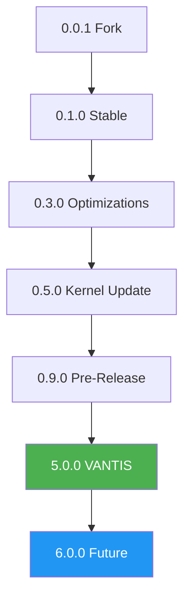

# 📜 Changelog VANTIS OS

Wszystkie godne uwagi zmiany w tym projekcie będą udokumentowane w tym pliku.

Format ten oparty jest na [Keep a Changelog](https://keepachangelog.com/en/1.0.0/),
i ten projekt przestrzega [Semantic Versioning](https://semver.org/spec/v2.0.0.html).

---

## [Unreleased]

### Planowane
- Cortex AI - Lokalny LLM i automatyzacja
- Horizon UI - Wszystkie 3 style interfejsu
- Vantis Aegis - Pełne wsparcie gaming z anti-cheat
- Certyfikacja EAL 7+
- Wielojęzyczna dokumentacja (9 języków)

---

## [5.0.0-alpha] - 2026-01-25

### 🚀 Dodano
- **Vantis Microkernel** - Minimalistyczne jądro z formalną weryfikacją
- **Neural Scheduler** - AI-based planista CPU
- **VantisFS** - System plików z atomowymi aktualizacjami A/B
- **Vantis Vault** - Kaskadowe szyfrowanie (AES → Twofish → Serpent)
- **Wraith Mode** - Tryb prywatności z RAM-only i Tor
- **Sentinel** - Izolacja sterowników w userspace
- GitHub Actions CI/CD Pipeline (Sentinel)
- Docker Hermetic Build Environment
- Formalna weryfikacja z Verus
- Supply Chain Security (SLSA Level 4)

### 🛡️ Bezpieczeństwo
- Implementowano protokoły zgodności **EAL 7+**
- Dodano wymuszanie podpisywania GPG
- Panic Protocol - Natychmiastowe niszczenie kluczy
- Crypto Cascade - Trójwarstwowe szyfrowanie

### 📚 Dokumentacja
- Wielojęzyczne README (PL, DE, FR, ES)
- Kompletna dokumentacja architektury
- Przewodniki instalacji
- Dokumentacja bezpieczeństwa

### 🐛 Naprawiono
- Brak (Pierwsze wydanie)

---

## [0.9.0] - 2024-XX-XX

### 🚀 Dodano
- Aktualizacja cookbook z nowymi pakietami
- Ulepszona konfiguracja CI/CD

### ⚡ Zmieniono
- Zaktualizowano zależności systemu
- Optymalizacja procesu budowania

### 🐛 Naprawiono
- Drobne poprawki stabilności

---

## [0.8.0] - 2024-XX-XX

### 🚀 Dodano
- Nowe funkcje obrazów CI

### ⚡ Zmieniono
- Naprawiono ci-img
- Zaktualizowano konfigurację CI

### 🐛 Naprawiono
- Problemy z budowaniem obrazów CI

---

## [0.7.0] - 2024-XX-XX

### 🚀 Dodano
- Główne wydanie 0.7.0
- Nowe funkcje stabilności

### ⚡ Zmieniono
- Znaczące ulepszenia wydajności
- Zaktualizowano komponenty systemu

### 🐛 Naprawiono
- Różne poprawki błędów

---

## [0.6.0] - 2024-XX-XX

### 🚀 Dodano
- Instalacja parted w GitLab CI
- Ulepszone narzędzia partycjonowania

### ⚡ Zmieniono
- Zaktualizowano pipeline CI/CD
- Ulepszona obsługa dysków

### 🐛 Naprawiono
- Problemy z partycjonowaniem w CI

---

## [0.5.0] - 2024-XX-XX

### 🚀 Dodano
- Główna aktualizacja kernela
- Nowe funkcje jądra systemu

### ⚡ Zmieniono
- Zaktualizowano kernel do najnowszej wersji
- Ulepszona wydajność jądra

### 🐛 Naprawiono
- Krytyczne poprawki bezpieczeństwa kernela
- Problemy ze stabilnością

---

## [0.4.1] - 2024-XX-XX

### 🚀 Dodano
- Aktualizacja cookbook
- Nowe pakiety i narzędzia

### ⚡ Zmieniono
- Zaktualizowano zależności
- Ulepszona kompatybilność pakietów

### 🐛 Naprawiono
- Drobne problemy z pakietami

---

## [0.3.5] - 2023-XX-XX

### 🚀 Dodano
- Poprawki budowania

### ⚡ Zmieniono
- Naprawiono proces budowania
- Ulepszona stabilność kompilacji

### 🐛 Naprawiono
- Krytyczne błędy budowania
- Problemy z zależnościami

---

## [0.3.4] - 2023-XX-XX

### 🚀 Dodano
- Aktualizacja cookbook
- Nowe pakiety systemowe

### ⚡ Zmieniono
- Zaktualizowano komponenty systemu
- Ulepszona integracja pakietów

### 🐛 Naprawiono
- Problemy z kompatybilnością pakietów

---

## [0.3.3] - 2023-XX-XX

### 🚀 Dodano
- Nowa metoda linkowania live filesystem
- Zmniejszono rozmiar live filesystem do 256 MB

### ⚡ Zmieniono
- Optymalizacja rozmiaru systemu
- Ulepszona wydajność live system

### 🐛 Naprawiono
- Problemy z pamięcią w live mode
- Optymalizacja zużycia zasobów

---

## [0.3.2] - 2023-XX-XX

### 🚀 Dodano
- Aktualizacja cookbook
- Nowe narzędzia systemowe

### ⚡ Zmieniono
- Zaktualizowano pakiety
- Ulepszona stabilność systemu

### 🐛 Naprawiono
- Drobne błędy pakietów

---

## [0.3.1] - 2023-XX-XX

### 🚀 Dodano
- Aktualizacja kernela
- Nowe funkcje jądra

### ⚡ Zmieniono
- Zaktualizowano kernel
- Ulepszona wydajność systemu

### 🐛 Naprawiono
- Krytyczne poprawki kernela
- Problemy ze stabilnością

---

## [0.3.0] - 2023-XX-XX

### 🚀 Dodano
- Aktualizacja Rust
- Nowa wersja kompilatora

### ⚡ Zmieniono
- Zaktualizowano Rust do najnowszej wersji
- Ulepszona kompilacja

### 🐛 Naprawiono
- Problemy z kompilatorem
- Optymalizacja wydajności

---

## [0.2.0] - 2023-XX-XX

### 🚀 Dodano
- Aktualizacja README.md
- Ulepszona dokumentacja

### ⚡ Zmieniono
- Przepisano dokumentację
- Dodano więcej przykładów

### 🐛 Naprawiono
- Błędy w dokumentacji
- Nieaktualne informacje

---

## [0.1.5] - 2022-XX-XX

### 🚀 Dodano
- Aktualizacja instalatora
- Aktualizacja programów systemowych

### ⚡ Zmieniono
- Zaktualizowano installer
- Ulepszone narzędzia systemowe

### 🐛 Naprawiono
- Problemy z instalacją
- Błędy programów

---

## [0.1.4] - 2022-XX-XX

### 🚀 Dodano
- Aktualizacja coreutils
- Nowe narzędzia podstawowe

### ⚡ Zmieniono
- Zaktualizowano coreutils
- Ulepszona funkcjonalność narzędzi

### 🐛 Naprawiono
- Błędy w narzędziach podstawowych
- Problemy z kompatybilnością

---

## [0.1.3] - 2022-XX-XX

### 🚀 Dodano
- Aktualizacja sterowników
- Nowe sterowniki sprzętowe

### ⚡ Zmieniono
- Zaktualizowano drivers
- Ulepszona obsługa sprzętu

### 🐛 Naprawiono
- Problemy ze sterownikami
- Błędy kompatybilności sprzętowej

---

## [0.1.2] - 2022-XX-XX

### 🚀 Dodano
- Dodano więcej ID e1000
- Rozszerzone wsparcie kart sieciowych

### ⚡ Zmieniono
- Ulepszona obsługa kart sieciowych Intel
- Dodano nowe identyfikatory sprzętu

### 🐛 Naprawiono
- Problemy z rozpoznawaniem kart sieciowych
- Błędy sterownika e1000

---

## [0.1.1] - 2022-XX-XX

### 🚀 Dodano
- Aktualizacja submodułów
- Synchronizacja z upstream

### ⚡ Zmieniono
- Zaktualizowano wszystkie submoduły
- Ulepszona integracja komponentów

### 🐛 Naprawiono
- Problemy z zależnościami
- Konflikty wersji

---

## [0.1.0] - 2022-XX-XX

### 🚀 Dodano
- Pierwsze stabilne wydanie 0.1.0
- Merge z master branch Redox OS

### ⚡ Zmieniono
- Główna synchronizacja z Redox OS
- Stabilizacja systemu

### 🐛 Naprawiono
- Różne błędy stabilności
- Problemy z integracją

---

## [0.0.9] - 2021-XX-XX

### 🚀 Dodano
- Aktualizacja ion (shell)
- Aktualizacja orbutils (narzędzia GUI)

### ⚡ Zmieniono
- Zaktualizowano powłokę systemową
- Ulepszone narzędzia graficzne

### 🐛 Naprawiono
- Błędy w powłoce
- Problemy z narzędziami GUI

---

## [0.0.8] - 2021-XX-XX

### 🚀 Dodano
- Aktualizacja stosu sieciowego
- Poprawki bezpieczeństwa sieci

### ⚡ Zmieniono
- Przepisano części stosu sieciowego
- Ulepszona wydajność sieci

### 🐛 Naprawiono
- Krytyczne błędy sieciowe
- Problemy z połączeniami
- Luki bezpieczeństwa

---

## [0.0.7] - 2021-XX-XX

### 🚀 Dodano
- Aktualizacja README
- Aktualizacja ion shell

### ⚡ Zmieniono
- Ulepszona dokumentacja
- Zaktualizowano powłokę

### 🐛 Naprawiono
- Błędy dokumentacji
- Problemy z powłoką

---

## [0.0.6] - 2021-XX-XX

### 🚀 Dodano
- Aktualizacja init do obsługi katalogów
- Ulepszone zarządzanie systemem plików

### ⚡ Zmieniono
- Przepisano proces inicjalizacji
- Dodano obsługę katalogów w init

### 🐛 Naprawiono
- Problemy z inicjalizacją
- Błędy systemu plików

---

## [0.0.5] - 2021-XX-XX

### 🚀 Dodano
- Merge pull request #783
- Poprawki problemów VirtualBox

### ⚡ Zmieniono
- Workaround dla problemu z leftover grant
- Zaktualizowano orbital
- Zaktualizowano redoxfs i orbutils

### 🐛 Naprawiono
- Problemy z VirtualBox
- Błędy unmapping grant
- Problemy z kompatybilnością VM

---

## [0.0.4] - 2021-XX-XX

### 🚀 Dodano
- Dodano skip cleanup do deploy
- Ulepszone wdrażanie

### ⚡ Zmieniono
- Naprawiono kompilację udpd
- Zaktualizowano submoduły
- Zaktualizowano orbutils
- Zaktualizowano orbital i orbutils

### 🐛 Naprawiono
- Problemy z wdrażaniem
- Błędy kompilacji udpd
- Problemy z GUI

---

## [0.0.3] - 2021-XX-XX

### 🚀 Dodano
- Dodano budowanie ISO
- Możliwość tworzenia obrazów instalacyjnych

### ⚡ Zmieniono
- Cache cargo dla szybszej kompilacji
- Ulepszone skrypty Travis

### 🐛 Naprawiono
- Problemy z SSL na Travis
- Błędy kompilacji

---

## [0.0.2] - 2021-XX-XX

### 🚀 Dodano
- Cache cargo
- Przyspieszenie kompilacji

### ⚡ Zmieniono
- Skrypt Travis wymaga completion
- Ulepszona konfiguracja CI

### 🐛 Naprawiono
- Problemy z SSL na Travis
- Błędy aktualizacji
- Problemy z nadpisywaniem bin.gz

---

## [0.0.1] - 2021-XX-XX

### 🚀 Dodano
- Pierwsze wydanie VANTIS OS
- Fork z Redox OS
- Podstawowa infrastruktura CI/CD

### ⚡ Zmieniono
- Poprawka dla SSL na Travis
- Automatyczna aktualizacja gdy wymagana
- Wymuszenie nadpisywania bin.gz

### 🐛 Naprawiono
- Problemy z SSL
- Błędy wdrażania
- Problemy z kompilacją

### 📝 Uwagi
- To jest pierwsze wydanie oparte na Redox OS
- Początek projektu VANTIS OS
- Podstawowa funkcjonalność systemu

---

## 📊 Statystyki Wersji

### Wersje Główne
- **5.0.0-alpha** - Pierwsze wydanie VANTIS (2026-01-25)
- **0.9.0** - Ostatnie wydanie przed 5.0
- **0.1.0** - Pierwsze stabilne wydanie
- **0.0.1** - Pierwsze wydanie (fork Redox OS)

### Całkowita Liczba Wydań
- **28 tagów** (0.0.1 - 0.9.0, 5.0.0-alpha)
- **9,047 commitów**
- **174 współpracowników**

---

## 🏆 Kamienie Milowe

### ✅ Ukończone
- [x] Fork Redox OS (0.0.1)
- [x] Stabilne wydanie (0.1.0)
- [x] Microkernel z formalną weryfikacją (5.0.0)
- [x] VantisFS z atomowymi aktualizacjami (5.0.0)
- [x] Vantis Vault - kaskadowe szyfrowanie (5.0.0)
- [x] Wraith Mode - prywatność (5.0.0)

### 🔥 W Trakcie
- [ ] Cortex AI - lokalne LLM
- [ ] Horizon UI - wszystkie 3 style
- [ ] Vantis Aegis - gaming
- [ ] Certyfikacja EAL 7+

### 📋 Planowane
- [ ] v6.0.0 - Distributed computing
- [ ] v7.0.0 - Quantum-resistant cryptography
- [ ] v8.0.0 - Advanced AI features

---

## 📈 Trendy Rozwoju

---

## 🔄 Strategia Wydawania

### Cykl Wydawniczy
- **Major Release (x.0.0)** - Rocznie, przełomowe zmiany
- **Minor Release (x.y.0)** - Co 3 miesiące, nowe funkcje
- **Patch Release (x.y.z)** - Co tydzień, poprawki błędów

### Polityka Wsparcia
- **Current (5.x.x)** - Pełne wsparcie do 2027
- **Previous (0.9.x)** - Wsparcie bezpieczeństwa do 2026
- **Legacy (0.1.x - 0.8.x)** - Brak wsparcia

---

## 🎯 Kategorie Zmian

### Symbole Kategorii

| Emoji | Kategoria | Opis |
|-------|-----------|------|
| 🚀 | Dodano | Nowe funkcje |
| ⚡ | Zmieniono | Zmiany w istniejących funkcjach |
| 🐛 | Naprawiono | Poprawki błędów |
| 🗑️ | Usunięto | Usunięte funkcje |
| 🔒 | Bezpieczeństwo | Poprawki bezpieczeństwa |
| ⚡ | Wydajność | Optymalizacje wydajności |
| 📚 | Dokumentacja | Zmiany w dokumentacji |
| 🧪 | Testowanie | Nowe testy lub poprawki |
| 🎨 | Styling | Zmiany w formacie kodu |
| ♻️ | Refaktoryzacja | Refaktoryzacja kodu |

---

## 📞 Wsparcie i Zgłaszanie

### Zgłaszanie Problemów
- **GitHub Issues:** https://github.com/vantisCorp/VantisOS/issues
- **Email:** bugs@vantis.os
- **Discord:** https://discord.gg/vantis

### Proponowanie Funkcji
- **GitHub Discussions:** https://github.com/vantisCorp/VantisOS/discussions
- **Email:** features@vantis.os
- **Discord:** #feature-requests

---

## 🙏 Podziękowania

Dziękujemy wszystkim współpracownikom, testerom i użytkownikom za wkład w VANTIS OS!

### Główni Współpracownicy
- **Jeremy Soller** - 6,047 commitów
- **Ribbon** - 1,195 commitów
- **Wildan M** - 315 commitów
- **bjorn3** - 174 commitów
- **vantisCorp** - 174 commitów

---

## 📄 Format Changelog

Ten changelog jest zgodny z formatem [Keep a Changelog](https://keepachangelog.com/en/1.0.0/).

**© 2025 VANTIS OS Corporation. Wszelkie prawa zastrzeżone.**

[⬆ Powrót na górę](#-changelog-vantis-os)

