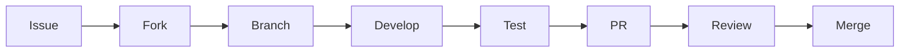

# ? Wklad w VANTIS OS - Instrukcja Wspolpracy

[](https://github.com/vantisCorp/VantisOS/graphs/contributors) [](http://makeapullrequest.com) [](LICENSE)

**? Dziekujemy za zainteresowanie wkladem w VANTIS OS! ?**

## ? Spis Tresci

-   [? Code of Conduct](#-code-of-conduct)
-   [? Jak Zaczac](#-jak-zacz%C4%85%C4%87)
-   [? Proces Rozwoju](#-proces-rozwoju)
-   [? Standardy Kodu](#-standardy-kodu)
-   [? Testowanie](#-testowanie)
-   [? Pull Requesty](#-pull-requesty)
-   [? Zglaszanie Bledow](#-zg%C5%82aszanie-b%C5%82%C4%99d%C3%B3w)
-   [? Proponowanie Funkcji](#-proponowanie-funkcji)
-   [? Dokumentacja](#-dokumentacja)

* * *

## ? Code of Conduct

### Zasady Zachowania

1.  **Szacunek** - Traktuj wszystkich z szacunkiem
2.  **Inkluzywnosc** - Witamy wklad od kazdego
3.  **Konstruktywna Krytyka** - Krytykuj pomysly, nie osoby
4.  **Collaboration** - Pracuj razem, nie przeciwko sobie
5.  **Open Communication** - Komunikuj sie otwarcie i szczerze

### Naruszenia

W razie naruszenia Code of Conduct, skontaktuj sie z:

-   Email: [conduct@vantis.os](mailto:conduct@vantis.os)
-   Discord: @moderator

* * *

## ? Jak Zaczac

### 1\. Fork i Klon

```bash
# Fork repozytorium na GitHub
# Klonuj swoj fork
git clone https://github.com/TWOJ_UZYTKOWNIK/VantisOS.git
cd VantisOS

# Dodaj upstream
git remote add upstream https://github.com/vantisCorp/VantisOS.git
```

### 2\. Konfiguracja Srodowiska

```bash
# Instalacja zaleznosci
./scripts/install_deps.sh

# Konfiguracja git hooks
pre-commit install

# Sprawdz srodowisko
make check-env
```

### 3\. Wybierz Zadanie

Szukaj etykiet:

-   `good first issue` - dobre dla poczatkujacych
-   `help wanted` - pomoc potrzebna
-   `enhancement` - nowe funkcje
-   `bug` - bledy do naprawienia

### 4\. Utworz Branch

```bash
# Pobierz najnowsze zmiany
git fetch upstream
git checkout main
git merge upstream/main

# Utworz branch dla swojego zadania
git checkout -b feature/NAZWA-FUNKCJI
# lub
git checkout -b fix/NAZWA-BLEDU
```

* * *

## ? Proces Rozwoju

### Workflow



### Standardy Branchowania

-   `main` - galaz glowna, stabilna
-   `develop` - galaz rozwojowa
-   `feature/*` - nowe funkcje
-   `fix/*` - naprawy bledow
-   `hotfix/*` - krytyczne naprawy
-   `release/*` - przygotowania do wydania

### Commit Messages

Format: `type(scope): description`

**Typy:**

-   `feat`: nowa funkcja
-   `fix`: naprawa bledu
-   `docs`: dokumentacja
-   `style`: formatowanie
-   `refactor`: refaktoryzacja
-   `test`: testy
-   `chore`: inne zmiany

**Przyklady:**

```bash
feat(core): add neural scheduler implementation
fix(ui): resolve memory leak in flux engine
docs(readme): update installation instructions
test(kernel): add unit tests for IPC
```

* * *

## ? Standardy Kodu

### Rust

```rust
// Formatowanie
cargo fmt

// Linting
cargo clippy -- -D warnings

// Dokumentacja
/// Krotki opis
///
/// # Przyklady
/// ```
/// let result = funkcja();
/// assert_eq!(result, oczekiwany_wynik);
/// ```
pub fn funkcja() -> Typ {
    // implementacja
}
```

### Formatowanie

```bash
# Automatyczne formatowanie
make format

# Sprawdzenie formatowania
make fmt-check
```

### Linting

```bash
# Uruchom clippy
make lint

# Napraw ostrzezenia
make lint-fix
```

### Formal Verification

```bash
# Weryfikacja formalna z Verus
make verify

# Generowanie dowodow
make prove
```

* * *

## ? Testowanie

### Rodzaje Testow

1.  **Unit Tests** - testy jednostkowe
2.  **Integration Tests** - testy integracyjne
3.  **Property Tests** - testy wlasciwosci
4.  **Fuzz Tests** - testy fuzzingowe
5.  **Formal Verification** - weryfikacja formalna

### Uruchamianie Testow

```bash
# Wszystkie testy
make test

# Tylko unit tests
make test-unit

# Tylko integration tests
make test-integration

# Z pokryciem kodu
make test-coverage

# Fuzzing
make fuzz

# Formal verification
make verify
```

### Pokrycie Kodu

Minimalne pokrycie: **80%**

```bash
# Sprawdz pokrycie
make coverage

# Generuj raport
make coverage-report
```

* * *

## ? Pull Requesty

### Przed PR

-   [ ]  Kod sformatowany (`cargo fmt`)
-   [ ]  Brak ostrzezen clippy (`cargo clippy`)
-   [ ]  Wszystkie testy przechodza (`make test`)
-   [ ]  Pokrycie kodu >=80%
-   [ ]  Formal verification (`make verify`)
-   [ ]  Dokumentacja zaktualizowana
-   [ ]  Commit message zgodny z konwencja
-   [ ]  CHANGELOG.md zaktualizowany

### Template PR

```markdown
## Opis
Krotki opis zmian

## Typ zmiany
- [ ] Bug fix
- [ ] New feature
- [ ] Breaking change
- [ ] Documentation update

## Testowanie
Opisz jak przetestowales zmiany

## Checklist
- [ ] Kod sformatowany
- [ ] Testy dodane/aktualizowane
- [ ] Dokumentacja zaktualizowana
- [ ] CHANGELOG.md zaktualizowany

## Zwiazane Issue
Closes #123
```

### Proces Review

1.  **Automated Checks** - CI/CD automatycznie sprawdza
2.  **Code Review** - co najmniej 2 recenzentow
3.  **Formal Verification** - weryfikacja formalna
4.  **Security Review** - przeglad bezpieczenstwa
5.  **Approval** - zatwierdzenie przez maintainerow

* * *

## ? Zglaszanie Bledow

### Template Bledu

```markdown
## Opis Bledu
Krotki i jasny opis bledu

## Srodowisko
- VANTIS OS Version: 
- Architecture: 
- Hardware: 

## Kroki do Reprodukcji
1. Idz do '...'
2. Kliknij '....'
3. Przewin do '....'
4. Zobacz blad

## Oczekiwane Zachowanie
Opisz co powinno sie stac

## Zrzuty Ekranu
Dodaj zrzuty ekranu jesli applicable

## Dodatkowy Kontekst
Logi, konfiguracja, itp.
```

### Priorytety Bledow

-   ? **Critical** - system nie dziala
-   ? **High** - glowna funkcja nie dziala
-   ? **Medium** - funkcja nie dziala poprawnie
-   ? **Low** - drobne problemy

* * *

## ? Proponowanie Funkcji

### Template Propozycji

```markdown
## Opis Funkcjonalnosci
Jasny i zwiezly opis

## Uzasadnienie
Dlaczego ta funkcja jest potrzebna?

## Rozwiazanie
Opisz proponowane rozwiazanie

## Alternatywy
Opisz alternatywne podejscia

## Dodatkowy Kontekst
Diagramy, mockupy, referencje
```

* * *

## ? Dokumentacja

### Standardy Dokumentacji

1.  **README** - przeglad projektu
2.  **ARCHITECTURE** - szczegolowa architektura
3.  **API** - dokumentacja API
4.  **GUIDES** - przewodniki uzytkownika
5.  **FAQ** - czesto zadawane pytania

### Formatowanie

````markdown
# Naglowek 1
## Naglowek 2
### Naglowek 3

**Pogrubienie**
*Kursywa*

`kod w linii`

```rust
blok kodu
````

-   Lista
    -   Podlista

| Tabela | Kolumna |
| --- | --- |
| Wiersz | Dane |

> Cytat

[Link](url) 

```

---

## ? Punkty Wkladu

### Punkty za Wklad

- Fix bug: **10** punktow
- New feature: **50** punktow
- Documentation: **20** punktow
- Code review: **5** punktow
- Security fix: **100** punktow

### Badge'y

- ? **Contributor** - 100+ punktow
- ? **Core Contributor** - 500+ punktow
- ? **Maintainer** - 1000+ punktow

---

## ? Kontakt

- **Discord**: https://discord.gg/vantis
- **Email**: dev@vantis.os
- **GitHub Issues**: https://github.com/vantisCorp/VantisOS/issues

---

## ? Podziekowania

Dziekujemy za Twoj wklad w VANTIS OS!

---

<div align="center">

**Stworzony z ? przez zespol VANTIS**

[? Powrot na gore](#-wklad-w-vantis-os---instrukcja-wspolpracy)

</div>
</div>
```
