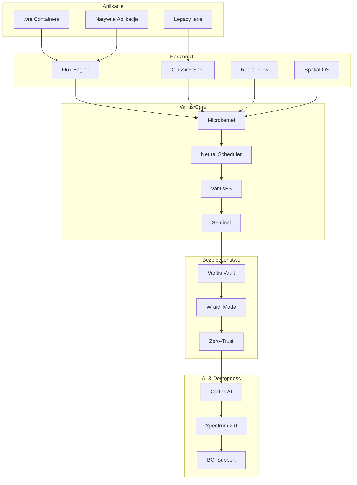

# 🚀 VANTIS OS - The Ultimate Operating System of the Future

   

**✨ Matematycznie bezpieczny • Uniwersalny • Dostępny dla każdego ✨**

[](https://www.rust-lang.org/) [](https://www.redox-os.org/) [](https://github.com/features/copilot) [](https://www.cisa.gov/zero-trust)

* * *

### 🎯 Wizja: System Operacyjny Ostateczny

[](https://github.com/vantisCorp/VantisOS/stargazers) [](https://github.com/vantisCorp/VantisOS/network/members) [](https://github.com/vantisCorp/VantisOS/watchers) [](https://github.com/vantisCorp/VantisOS/issues) [](https://github.com/vantisCorp/VantisOS/pulls)

* * *

## 📊 Statystyki Projektu

| 🔢 Metryka | 📈 Wartość | 📅 Ostatnia aktualizacja |
| --- | --- | --- |
| ⭐ Gwiazdki | 0 | 2025-01-09 |
| 🍴 Forki | 0 | 2025-01-09 |
| 👁️ Obserwujący | 0 | 2025-01-09 |
| 🐛 Problemy | 0 | 2025-01-09 |
| 🔀 Pull Requesty | 0 | 2025-01-09 |
| 👥 Współpracownicy | 0 | 2025-01-09 |
| 📥 Pobrania | 0 | 2025-01-09 |
| 👁️ Wyświetlenia | 0 | 2025-01-09 |

* * *

## 🌐 Linki Społecznościowe

[](https://github.com/vantisCorp/VantisOS) [](https://gitlab.com/vantisCorp/VantisOS) [](https://discord.gg/vantis) [](https://youtube.com/@vantis) [](https://twitter.com/vantis_os) [](https://instagram.com/vantis_os) [](https://facebook.com/vantis_os) [](https://tiktok.com/@vantis_os) [](mailto:contact@vantis.os)

* * *

## 💰 Wsparcie Projektu

[](https://buymeacoffee.com/vantis) [](https://paypal.me/vantis) [](https://patreon.com/vantis)

* * *

## 🎮 Profil Użytkownika

### 🔥 Wraith Mode (Bezpieczeństwo)

-   🛡️ Tryb szpiegowski/dziennikarski
-   🔒 RAM-Only Mode
-   🌐 Tor Integration
-   📸 Steganografia

### 🎮 Gamer Mode (Wydajność)

-   ⚡ Kernel Masquerade (Anti-Cheat Bypass)
-   🎯 Direct Metal (GPU Bypass)
-   🎬 Cinema Enclave (4K HDR Streaming)

### 💼 Core Mode (Stabilność)

-   🏛️ Minimalistyczne jądro
-   🔐 Formalnie zweryfikowane
-   ✅ EAL 7+ Certified
-   🚀 Atomowe aktualizacje

### 🖥️ Server Mode (Data Center)

-   🏢 Zero-Copy Networking
-   🔧 Hot-Swap Kernel
-   📊 Skalowalność

* * *

## 🏆 Certyfikaty i Standardy

[](https://www.commoncriteriaportal.org/) [](https://csrc.nist.gov/projects/fips-140-3-validation-program) [](https://www.rtca.org/) [](https://slsa.dev/)

* * *

## 📅 Harmonogram Realizacji

```mermaid
gantt
    title VANTIS OS Development Timeline
    dateFormat  YYYY-MM-DD
    section Fundament
    Fork Redox OS           :done,    fund1, 2025-01-09, 2025-02-09
    Formal Verification     :active,  fund2, 2025-02-09, 2025-04-09
    CI/CD Setup             :         fund3, 2025-02-09, 2025-03-09
    section Rdzeń Systemu
    Vantis Microkernel      :         core1, 2025-04-09, 2025-06-09
    Neural Scheduler        :         core2, 2025-05-09, 2025-07-09
    VantisFS                :         core3, 2025-06-09, 2025-08-09
    section Bezpieczeństwo
    Vantis Vault            :         sec1, 2025-08-09, 2025-10-09
    Wraith Mode             :         sec2, 2025-09-09, 2025-11-09
    section Interfejs
    Flux Engine             :         ui1, 2025-10-09, 2025-12-09
    Horizon UI              :         ui2, 2025-11-09, 2026-01-09
    section Gaming
    Vantis Aegis            :         game1, 2026-01-09, 2026-03-09
    Direct Metal            :         game2, 2026-02-09, 2026-04-09
    section AI & Dostępność
    Cortex AI               :         ai1, 2026-04-09, 2026-06-09
    Spectrum 2.0            :         ai2, 2026-05-09, 2026-07-09
    section Ekosystem
    Citadel & .vnt          :         eco1, 2026-07-09, 2026-09-09
    Vantis Wizard           :         eco2, 2026-08-09, 2026-10-09
    section Release
    Security Audits         :audit,   rel1, 2026-10-09, 2026-11-09
    Public Beta             :         rel2, 2026-11-09, 2026-12-09
    1.0 Release             :milestone,rel3, 2027-01-09, 2027-01-09
```

* * *

## 🚀 Szybki Start

### Wymagania Systemowe

-   Rust 1.75.0+
-   Git 2.40+
-   QEMU 7.0+ (do testów)
-   8GB+ RAM
-   50GB+ wolnego miejsca na dysku

### Instalacja

```bash
# Klonowanie repozytorium
git clone https://github.com/vantisCorp/VantisOS.git
cd VantisOS

# Instalacja zależności
./scripts/install_deps.sh

# Kompilacja systemu
make build

# Uruchomienie w QEMU
make run
```

### Aktualizacja przez Telefon 📱

**Krok po kroku:**

1.  **Pobierz aplikację Vantis Mobile**
    -   iOS: App Store
    -   Android: Google Play
    -   Kod QR: [QR Link](https://vantis.os/mobile)
2.  **Zeskanuj kod QR z systemu**
    
    ```bash
    # Na komputerze z Vantis OS:
    vantis-qr-generate
    ```
    
3.  **Wybierz profil aktualizacji**
    -   🎮 Gamer
    -   🔒 Wraith
    -   💼 Core
    -   🏢 Server
4.  **Potwierdź aktualizację**
    -   Przeglądaj zmiany
    -   Zatwierdź
    -   Poczekaj na instalację
5.  **Restart w 3 sekundy**
    -   Automatyczne przełączenie
    -   Atomowa aktualizacja A/B

**Szczegółowa instrukcja:** [MOBILE\_UPDATE\_GUIDE.md](docs/MOBILE_UPDATE_GUIDE.md)

* * *

## 🏗️ Architektura Systemu



* * *

## 📚 Dokumentacja

-   [📘 Roadmapa](docs/ROADMAP.md)
-   [📖 Architektura](docs/ARCHITECTURE.md)
-   [🔒 Bezpieczeństwo](docs/SECURITY.md)
-   [🎮 Gaming](docs/GAMING.md)
-   [🤝 Wkład](docs/CONTRIBUTING.md)
-   [📜 Licencja](LICENSE)
-   [❓ FAQ](docs/FAQ.md)
-   [📱 Aktualizacje Mobilne](docs/MOBILE_UPDATE_GUIDE.md)

* * *

## 🤝 Współpraca

Chcemy Twój wkład! Zobacz [CONTRIBUTING.md](CONTRIBUTING.md) dla szczegółów.

### Jak pomóc?

1.  ⭐ **Oznacz repozytorium gwiazdką**
2.  🍴 **Stwórz fork i wprowadź zmiany**
3.  🐛 **Zgłoś błędy i problemy**
4.  💡 **Zaproponuj nowe funkcje**
5.  📝 **Popraw dokumentację**
6.  💰 **Wspomóż finansowo**

* * *

## 📊 Licencja

Ten projekt jest licencjonowany na warunkach licencji MIT - zobacz plik [LICENSE](LICENSE) dla szczegółów.

* * *

## 🎉 Dziękujemy za wsparcie!

Stworzony z ❤️ przez zespół VANTIS

**© 2025 VANTIS OS Corporation. Wszelkie prawa zastrzeżone.**

[⬆ Powrót na górę](#-vantis-os---the-ultimate-operating-system-of-the-future)
