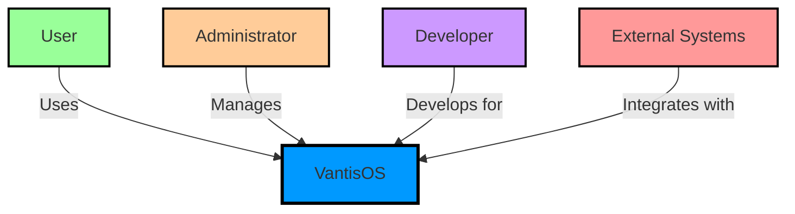
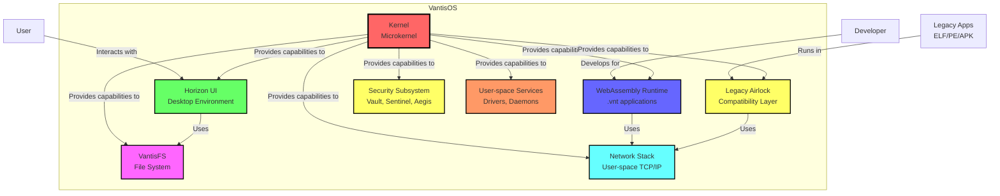
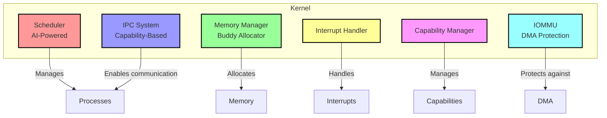
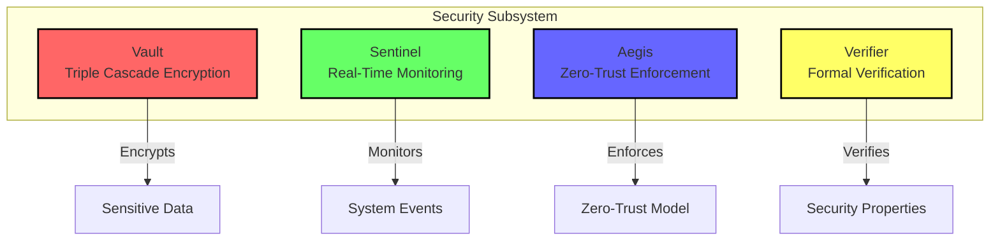
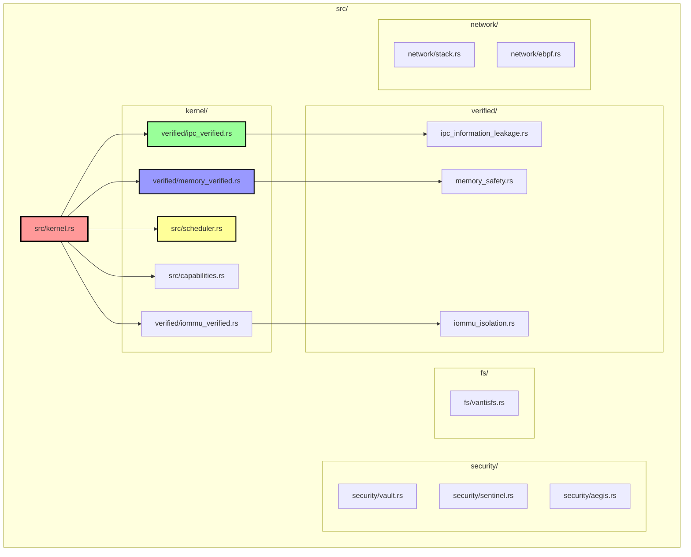
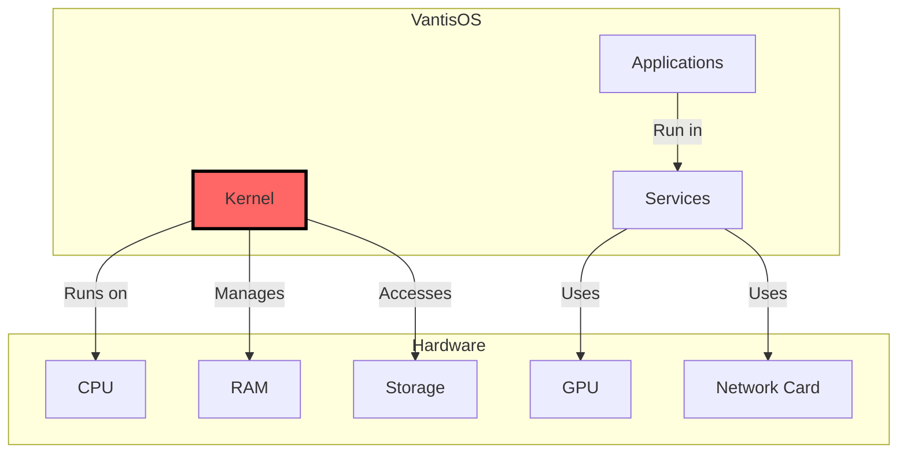
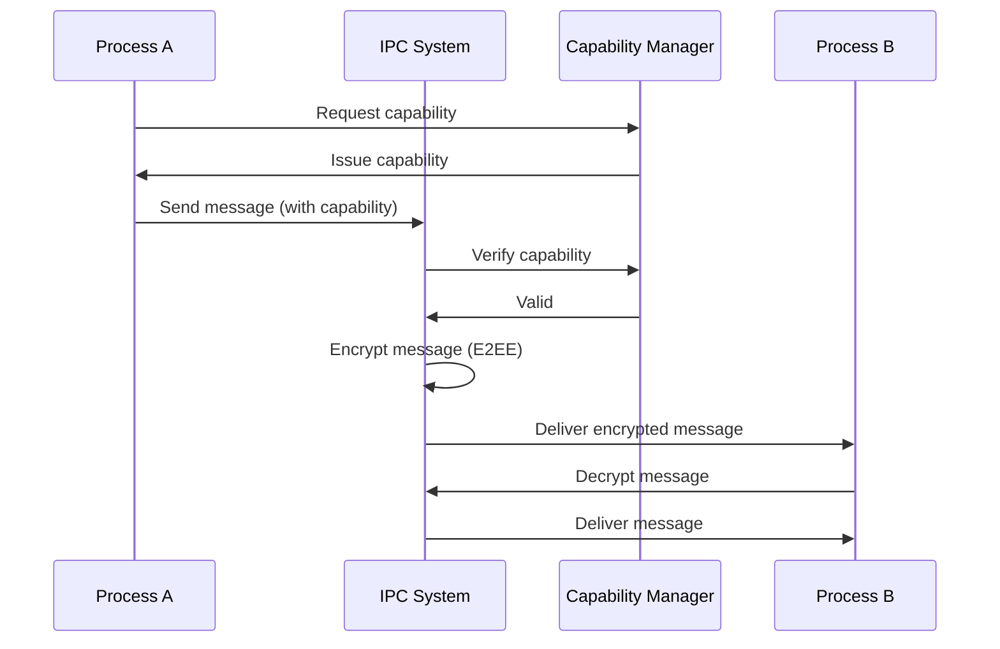
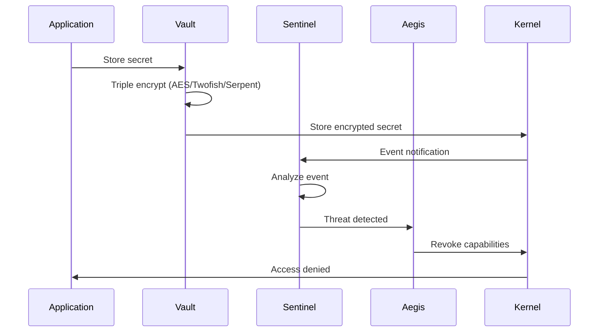

# C4 Model for VantisOS Architecture

## Overview

The C4 Model is a simple, hierarchical way to visualize software architecture. It provides four levels of abstraction:
1. **Context**: Big picture view of the system
2. **Containers**: Applications and data stores
3. **Components**: Internal structure of containers
4. **Code**: Classes and modules

## Level 1: System Context

### System Context Diagram

### System Description

**VantisOS**: A formally verified, microkernel-based operating system built with Rust.

**Users**: End users running VantisOS applications.

**Administrators**: System administrators managing VantisOS deployments.

**Developers**: Software developers creating applications for VantisOS.

**External Systems**: External systems integrating with VantisOS via APIs.

## Level 2: Containers

### Container Diagram

### Container Descriptions

**Kernel**: Microkernel providing essential services (scheduling, memory management, IPC).

**Horizon UI**: Desktop environment with ray tracing support.

**WebAssembly Runtime**: Runtime for .vnt (WASM) applications.

**Legacy Airlock**: Compatibility layer for ELF/PE/APK applications.

**VantisFS**: Custom file system with modern features.

**Network Stack**: User-space TCP/IP stack with eBPF/XDP.

**Security Subsystem**: Security components (Vault, Sentinel, Aegis).

**User-space Services**: Device drivers and system daemons.

## Level 3: Components

### Kernel Component Diagram

### Kernel Component Descriptions

**Scheduler**: Neural AI-powered thread scheduler with adaptive algorithms.

**Memory Manager**: Memory management with buddy allocator, no global allocator.

**IPC System**: Capability-based inter-process communication with E2EE.

**Interrupt Handler**: Low-level interrupt handling and dispatch.

**Capability Manager**: Management of capabilities for access control.

**IOMMU**: IOMMU for DMA attack prevention.

### Security Subsystem Component Diagram

### Security Component Descriptions

**Vault**: Secure storage with triple cascade encryption (AES/Twofish/Serpent).

**Sentinel**: Real-time security monitoring and threat detection.

**Aegis**: Zero-Trust enforcement and continuous verification.

**Verifier**: Formal verification of security properties.

## Level 4: Code

### Rust Module Structure

### Module Descriptions

**kernel.rs**: Kernel entry point and initialization.

**kernel/verified/**: Formally verified kernel components.

**verified/ipc_verified.rs**: Verified IPC system.

**verified/memory_verified.rs**: Verified memory management.

**verified/ipc_information_leakage.rs**: IPC security verification.

**verified/memory_safety.rs**: Memory safety proofs.

**verified/iommu_verified.rs**: IOMMU isolation proofs.

**security/vault.rs**: Vault encryption implementation.

**security/sentinel.rs**: Sentinel monitoring.

**security/aegis.rs**: Zero-Trust enforcement.

**fs/vantisfs.rs**: VantisFS file system.

**network/stack.rs**: Network stack.

**network/ebpf.rs**: eBPF packet filtering.

## Deployment View

## Data Flow

### IPC Data Flow

### Security Data Flow

## Technology Stack

| Component | Technology |
|-----------|------------|
| Kernel | Rust |
| Graphics | Vulkan |
| Applications | WebAssembly (WASM) |
| Documentation | Mermaid, Arc42 |
| Build | Cargo |
| Verification | Verus, Kani |
| Fuzzing | libFuzzer, AFL++ |
| CI/CD | GitHub Actions |

---

**Version**: 1.0  
**Created**: 2025-02-24  
**Last Updated**: 2025-02-24