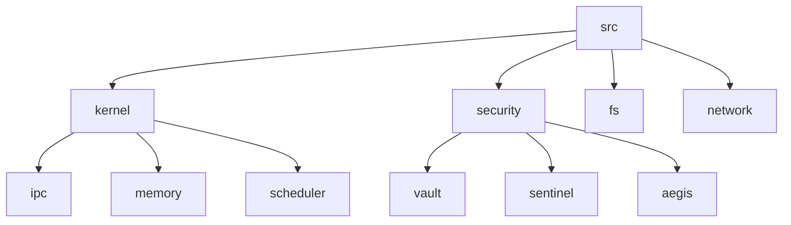

# Diagram Generation from Rust Code

## Overview

This document describes how to generate architecture diagrams from VantisOS Rust code automatically.

## Tools

### 1. Dependency Graph Generation

**cargo-deps**: Generate dependency graph from Cargo.toml

```bash
cargo install cargo-deps
cargo deps | dot -Tpng > deps.png
```

### 2. Module Structure Visualization

**cargo-modules**: Visualize Rust module structure

```bash
cargo install cargo-modules
cargo modules generate tree
cargo modules generate dot > modules.dot
dot -Tpng modules.dot > modules.png
```

### 3. Call Graph Generation

**cargo-callgraph**: Generate call graphs from Rust code

```bash
cargo install cargo-callgraph
cargo callgraph > callgraph.dot
dot -Tpng callgraph.dot > callgraph.png
```

### 4. Mermaid Integration

**Custom Script**: Generate Mermaid diagrams from Rust AST

```bash
./scripts/generate_mermaid.sh
```

## Automation

### GitHub Actions Workflow

```yaml
name: Generate Diagrams

on:
  push:
    branches: [main, 0.4.1]
  pull_request:

jobs:
  generate-diagrams:
    runs-on: ubuntu-latest
    steps:
      - uses: actions/checkout@v2
      
      - name: Install Rust tools
        run: |
          cargo install cargo-deps
          cargo install cargo-modules
          cargo install cargo-callgraph
      
      - name: Generate diagrams
        run: |
          cargo deps | dot -Tpng > docs/architecture/deps.png
          cargo modules generate dot > docs/architecture/modules.dot
          dot -Tpng docs/architecture/modules.dot > docs/architecture/modules.png
          cargo callgraph > docs/architecture/callgraph.dot
          dot -Tpng docs/architecture/callgraph.dot > docs/architecture/callgraph.png
          ./scripts/generate_mermaid.sh
      
      - name: Commit diagrams
        run: |
          git config --local user.email "action@github.com"
          git config --local user.name "GitHub Action"
          git add docs/architecture/*.png
          git commit -m "chore: update architecture diagrams" || true
          git push
```

## Mermaid Diagrams

### Module Structure



### Dependency Graph

```mermaid
graph LR
    kernel --> [ipc]
    kernel --> [memory]
    kernel --> [scheduler]
    [ipc] --> [capabilities]
    [memory] --> [buddy_alloc]
    [scheduler] --> [neural_net]
```

## Structurizr Integration

**Structurizr**: Java-based tool for C4 model

```bash
# Install Structurizr
wget https://github.com/structurizr/java/releases/latest/structurizr-cli.zip
unzip structurizr-cli.zip

# Generate C4 model
./structurizr-cli export -workspace docs/architecture/structurizr/workspace.dsl -format plantuml
```

### Structurizr DSL

```dsl
workspace "VantisOS" {
    model {
        user = person "User"
        vantisos = softwareSystem "VantisOS" {
            kernel = container "Kernel"
            ui = container "Horizon UI"
            runtime = container "WebAssembly Runtime"
            
            user --> ui "Uses"
            ui --> kernel "Requests"
            runtime --> kernel "Uses"
        }
    }
}
```

## Manual Updates

### Updating C4 Model

1. Update [C4_MODEL.md](C4_MODEL.md)
2. Generate new diagrams with tools
3. Update Mermaid diagrams
4. Commit changes

### Updating arc42

1. Update [arc42_VantisOS.md](arc42_VantisOS.md)
2. Update ADR references
3. Update module structures
4. Commit changes

## Best Practices

1. **Automate**: Automate diagram generation where possible
2. **Keep in sync**: Keep diagrams in sync with code
3. **Document**: Document diagram generation process
4. **Version**: Version diagrams with code
5. **Review**: Review diagrams in PRs

---

**Version**: 1.0  
**Created**: 2025-02-24  
**Last Updated**: 2025-02-24