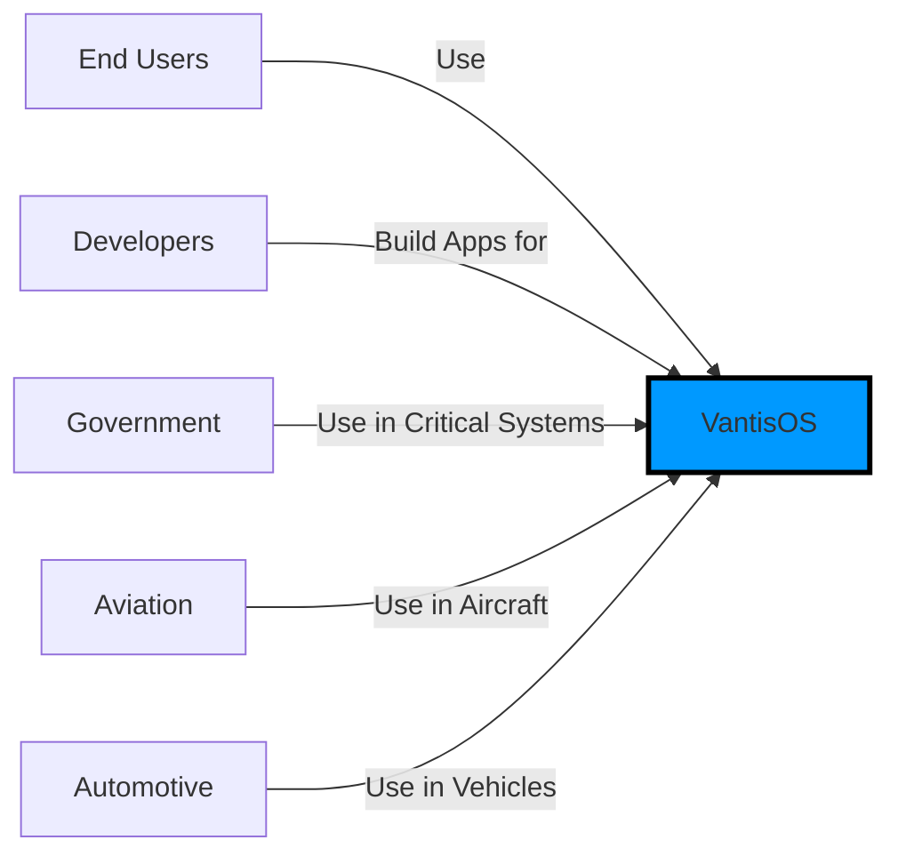

# arc42 Template for VantisOS Architecture

## About arc42

arc42 is a template for architecture communication. It helps teams document software architecture in a structured way.

Template version: 8.2 EN  
Based on: [arc42.org](https://arc42.org)

---

## 1. Introduction and Goals

### 1.1 Requirements Overview

**VantisOS Requirements**:

**Functional Requirements**:
- [FR-1] Provide formally verified microkernel
- [FR-2] Execute WebAssembly (.vnt) applications
- [FR-3] Provide legacy compatibility (ELF/PE/APK)
- [FR-4] Implement capability-based IPC
- [FR-5] Provide modern graphics stack (Vulkan)
- [FR-6] Implement secure storage (Vault)

**Non-Functional Requirements**:
- [NFR-1] Formal verification of critical components (EAL7+)
- [NFR-2] Memory safety (no buffer overflows, use-after-free)
- [NFR-3] Maximum security (Zero-Trust model)
- [NFR-4] Performance: ≥ 80% of native for WASM
- [NFR-5] Reliability: 99.999% uptime
- [NFR-6] Regulatory compliance: ISO 27001, FIPS 140-3

**Quality Goals**:
1. **Security**: Highest possible security through formal verification
2. **Correctness**: Mathematical proofs of critical properties
3. **Performance**: Competitive performance despite safety features
4. **Reliability**: Self-healing and fault tolerance
5. **Transparency**: Open, documented architecture

### 1.2 Quality Goals

| Quality Goal | Scenario | Priority |
|--------------|----------|----------|
| Security | Memory-safety attacks prevented | P0 |
| Formal Verification | All kernel components verified | P0 |
| Performance | WASM apps run at 80% native speed | P1 |
| Reliability | System recovers from failures in 100ms | P1 |
| Usability | Developers can build apps easily | P2 |

### 1.3 Stakeholders

| Stakeholder | Role | Concerns |
|-------------|------|----------|
| End Users | Run applications on VantisOS | Security, reliability |
| Developers | Build applications for VantisOS | API quality, documentation |
| Government | Use VantisOS for critical systems | Certifications (EAL7+, ISO 27001) |
| Aviation | Use VantisOS in aircraft | Safety certification (DO-178C) |
| Automotive | Use VantisOS in vehicles | Safety certification (ISO 26262) |
| Security Researchers | Audit VantisOS for vulnerabilities | Transparency, formal proofs |

---

## 2. Architecture Constraints

### 2.1 Technical Constraints

1. **Language**: Must use Rust for all kernel code
2. **Microkernel**: Kernel must be minimal (<10,000 LOC)
3. **No POSIX**: Must not be POSIX-compliant
4. **Formal Verification**: All kernel components must be verified
5. **WebAssembly**: Primary application format

### 2.2 Organizational Constraints

1. **Open Source**: Must be open source
2. **Community-driven**: Community governance
3. **Documentation**: Docs-as-Code approach
4. **Certifications**: Must achieve EAL7+, ISO 27001, FIPS 140-3

### 2.3 Political Constraints

1. **No external dependencies**: Minimize external dependencies
2. **Vendor-agnostic**: Not tied to specific vendors
3. **Standards-compliant**: Follow industry standards (not POSIX)

---

## 3. System Scope and Context

### 3.1 Business Context

### 3.2 Technical Context

**Technical Context** (see [C4 Model](C4_MODEL.md) for details)

---

## 4. Solution Strategy

### 4.1 Key Decisions

| Decision | ADR | Status |
|----------|-----|--------|
| Use Rust as primary language | ADR-0001 | Accepted |
| Adopt microkernel architecture | ADR-0002 | Accepted |
| Reject POSIX compliance | ADR-0003 | Accepted |
| Capability-based IPC | ADR-0004 | Accepted |
| Formal verification with Verus/Kani | ADR-0005 | Accepted |
| No global allocator in kernel | ADR-0006 | Accepted |
| Legacy Airlock for compatibility | ADR-0007 | Accepted |
| WebAssembly as primary format | ADR-0008 | Accepted |
| E2EE for IPC | ADR-0009 | Accepted |
| Triple cascade encryption | ADR-0010 | Accepted |

### 4.2 Architecture Principles

1. **Formal Verification First**: All critical components must be formally verified
2. **Security > Compatibility**: Security is more important than compatibility
3. **Zero-Trust**: Never trust, always verify
4. **Capability-Based**: All access controlled via capabilities
5. **Simplicity**: Simple, verifiable design

---

## 5. Building Block View

### 5.1 Whitebox Overall System

**Overall System** (see [C4 Model](C4_MODEL.md) for details)

### 5.2 Runtime Architecture

**Kernel Components**:
- Scheduler: AI-powered, verified
- Memory Manager: Buddy allocator, verified
- IPC: Capability-based, E2EE, verified
- Interrupt Handler: Verified

**User-Space Components**:
- WebAssembly Runtime: AOT compilation
- Legacy Airlock: Compatibility layer
- VantisFS: File system
- Network Stack: User-space TCP/IP
- Security Subsystem: Vault, Sentinel, Aegis

---

## 6. Runtime View

### 6.1 Runtime Structure

**Process Model**:
- User-space processes isolated
- Capability-based IPC
- No shared memory
- Secure communication

### 6.2 Important Scenarios

**Scenario 1: Process Communication**:
1. Process A requests capability from Capability Manager
2. Capability Manager issues capability
3. Process A sends message via IPC (with capability)
4. IPC verifies capability
5. IPC encrypts message (E2EE)
6. IPC delivers to Process B
7. Process B decrypts message

**Scenario 2: Application Execution**:
1. User launches .vnt (WASM) application
2. WebAssembly Runtime loads .vnt
3. Runtime verifies bytecode
4. Runtime compiles to native code (AOT)
5. Application requests capabilities
6. Capability Manager verifies and issues capabilities
7. Application runs with granted capabilities

---

## 7. Deployment View

### 7.1 Infrastructure

**Deployment Architecture** (see [C4 Model](C4_MODEL.md) for details)

### 7.2 Cross-Cutting Concepts

**Security Concepts**:
- Zero-Trust model
- Capability-based access control
- End-to-end encryption
- Formal verification

**Performance Concepts**:
- AOT compilation
- Zero-copy IPC
- AI-powered scheduling

---

## 8. Concepts

### 8.1 Domain Concepts

**Capabilities**:
- Unforgeable tokens granting access
- Transferable and revocable
- Contain permissions

**Formal Verification**:
- Mathematical proofs of correctness
- Verus for functional correctness
- Kani for safety properties

**WebAssembly**:
- Primary application format (.vnt)
- Sandboxed execution
- Portable across architectures

### 8.2 Solution Concepts

**Microkernel**:
- Minimal kernel (<10,000 LOC)
- User-space services
- Capability-based IPC

**Legacy Airlock**:
- Compatibility layer
- Sandboxed execution
- Supports ELF/PE/APK

**Zero-Trust**:
- Never trust, always verify
- Continuous verification
- Minimal privileges

---

## 9. Design Decisions

See [ADR directory](../../adr/) for all architecture decisions.

---

## 10. Risks and Technical Debts

### 10.1 Risks

| Risk | Impact | Probability | Mitigation |
|------|--------|-------------|------------|
| Performance overhead too high | High | Medium | AOT compilation, optimization |
| Verification takes too long | High | Medium | Parallel verification, automated |
| Developer adoption low | Medium | High | Good documentation, tools |
| Certification delays | High | Medium | Start early, dedicated team |

### 10.2 Technical Debts

1. **Legacy Airlock**: Complex compatibility layer
2. **AI Scheduler**: Complex neural network, hard to verify
3. **Verification**: Some components not yet verified

---

## 11. Glossary

| Term | Definition |
|------|------------|
| ADR | Architecture Decision Record |
| AOT | Ahead-Of-Time compilation |
| E2EE | End-to-End encryption |
| IPC | Inter-Process Communication |
| TCB | Trusted Computing Base |
| WASM | WebAssembly |
| Zero-Trust | Security model with no implicit trust |

---

## 12. Appendix

### 12.1 Tools and Frameworks

| Tool | Purpose |
|------|---------|
| Rust | Programming language |
| Verus | Formal verification (functional) |
| Kani | Formal verification (safety) |
| libFuzzer | Fuzzing |
| AFL++ | Fuzzing |
| OSS-Fuzz | Continuous fuzzing |
| Mermaid | Diagrams |
| arc42 | Architecture documentation |

### 12.2 References

- [VantisOS MANIFEST.md](../../MANIFEST.md)
- [ADR Directory](../../adr/)
- [RFC Directory](../../rfc/)
- [C4 Model](C4_MODEL.md)
- [Verification Status](../reports/VERIFICATION_STATUS.md)

---

**Version**: 1.0  
**Created**: 2025-02-24  
**Last Updated**: 2025-02-24