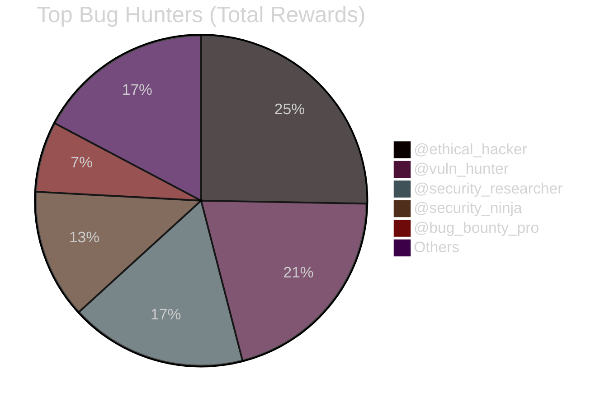
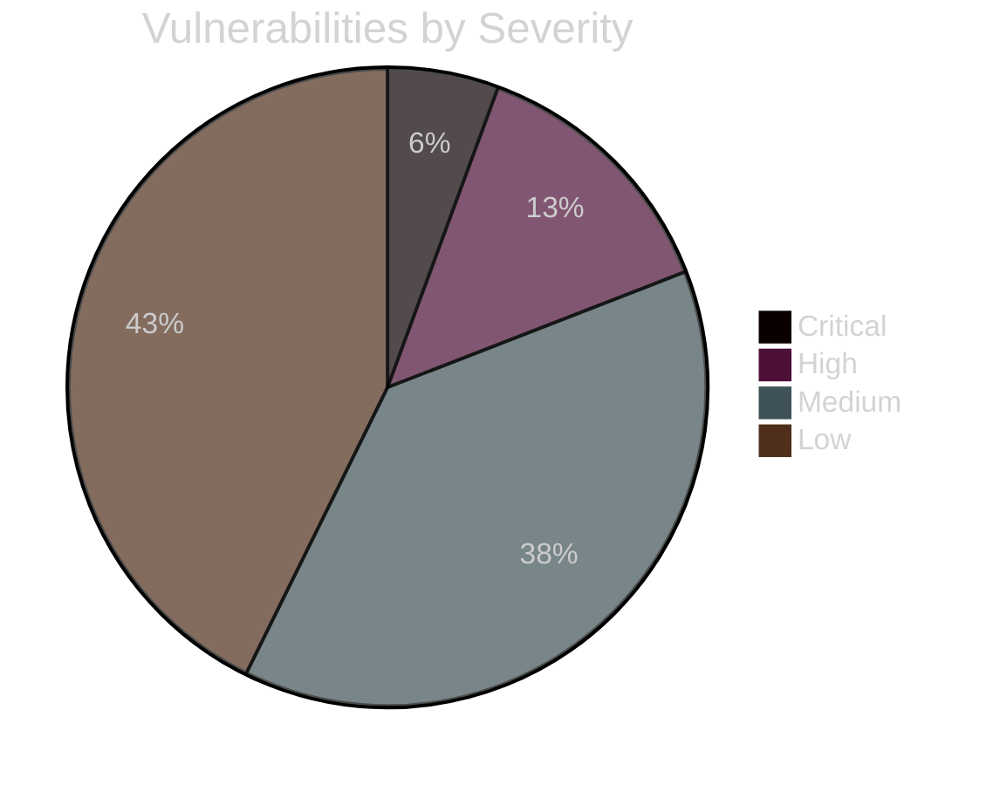

<div align="center">

  

  <a href="https://vantis.os/bounty">
    
  </a>

  <br/><br/>

  
  
  

</div>

---

## 🌐 Language / Język / Sprache

[🇺🇸 English](#english) | [🇵🇱 Polski](#polski) | [🇩🇪 Deutsch](#deutsch)

---

# English

## 🎯 Program Overview

The **VANTIS OS Bug Bounty Program** rewards security researchers who help us identify and fix vulnerabilities in VANTIS OS. We believe in responsible disclosure and fair compensation for security research.

### 💰 Reward Structure

| Severity | Reward | Response Time | Fix Time |
|----------|--------|---------------|----------|
| 🚨 **Critical** | **$10,000** | 4 hours | 24 hours |
| 🔴 **High** | **$5,000** | 1 day | 3 days |
| 🟡 **Medium** | **$1,000** | 3 days | 7 days |
| 🟢 **Low** | **$500** | 7 days | 14 days |

### 🏆 Bonus Rewards

- **First Reporter Bonus:** +50% for being the first to report a vulnerability
- **Quality Report Bonus:** +25% for exceptionally detailed reports with PoC
- **Multiple Bugs Bonus:** +10% per additional bug in same report (max 3)
- **Critical Chain Bonus:** +100% for finding exploit chains

---

## 🎯 Scope

### ✅ In Scope

#### Core System
- 🏛️ Vantis Microkernel
- 🧠 Neural Scheduler
- 📁 VantisFS
- 🛡️ Sentinel (Driver isolation)

#### Security Components
- 🔒 Vantis Vault (Encryption)
- 👻 Wraith Mode (Privacy)
- 🔐 Panic Protocol
- 🔑 Key Management

#### User Interface
- 🎨 Horizon UI
- 🖥️ Classic+ Shell
- 🔄 Radial Flow
- 🌐 Spatial OS

#### AI & Services
- 🤖 Cortex AI
- 🔍 Semantic Search
- ⚙️ Automation Engine

#### Ecosystem
- 📦 .vnt Container Format
- 🏪 Cytadela Store
- 🔗 Legacy Airlock

### ❌ Out of Scope

- Third-party applications
- User-generated content
- Social engineering attacks
- Physical attacks
- Denial of Service (DoS)
- Spam or abuse

---

## 🐛 Vulnerability Categories

### 🚨 Critical ($10,000)

**Examples:**
- Remote Code Execution (RCE)
- Privilege Escalation (kernel → root)
- Authentication Bypass
- Cryptographic Breaks (Vault compromise)
- Sandbox Escape (.vnt container breakout)
- Memory Corruption leading to code execution

**Requirements:**
- Reproducible exploit
- Proof of Concept (PoC)
- Detailed technical writeup
- No public disclosure before fix

### 🔴 High ($5,000)

**Examples:**
- Cross-Site Scripting (XSS) in system UI
- SQL Injection (if applicable)
- Authentication Bypass (non-critical)
- Information Disclosure (sensitive data)
- Local Privilege Escalation
- Kernel Memory Leak

**Requirements:**
- Reproducible steps
- Impact assessment
- Suggested fix (optional)

### 🟡 Medium ($1,000)

**Examples:**
- Cross-Site Request Forgery (CSRF)
- Information Disclosure (non-sensitive)
- Denial of Service (local)
- Logic Flaws
- Insecure Defaults

**Requirements:**
- Clear reproduction steps
- Impact description

### 🟢 Low ($500)

**Examples:**
- Minor information disclosure
- UI/UX security issues
- Configuration issues
- Best practice violations

**Requirements:**
- Description of issue
- Suggested improvement

---

## 📝 How to Report

### Step 1: Prepare Your Report

**Required Information:**
```markdown
## Vulnerability Report

### Summary
Brief description of the vulnerability

### Severity
Critical / High / Medium / Low

### Affected Component
- Component: [e.g., Vantis Vault]
- Version: [e.g., 5.0.0-alpha]
- Architecture: [e.g., x86_64]

### Description
Detailed technical description

### Steps to Reproduce
1. Step 1
2. Step 2
3. Step 3

### Proof of Concept
[Code, screenshots, or video]

### Impact
What can an attacker do with this vulnerability?

### Suggested Fix
[Optional but appreciated]

### Reporter Information
- Name: [Your name or pseudonym]
- Email: [Contact email]
- PGP Key: [Optional]
```

### Step 2: Submit Report

**Email:** security@vantis.os

**Subject:** `[BOUNTY] [SEVERITY] Brief Description`

**Example:** `[BOUNTY] [CRITICAL] RCE in Vantis Vault`

**PGP Encryption:** Recommended for sensitive reports
- **PGP Key:** [Download](https://vantis.os/pgp/security.asc)
- **Fingerprint:** `0xDEADBEEFCAFEBABE`

### Step 3: Wait for Response

| Severity | Response Time |
|----------|---------------|
| 🚨 Critical | 4 hours |
| 🔴 High | 1 day |
| 🟡 Medium | 3 days |
| 🟢 Low | 7 days |

### Step 4: Collaborate on Fix

- Work with our security team
- Verify the fix
- Test the patch

### Step 5: Receive Reward

- Reward paid via PayPal, Wire Transfer, or Cryptocurrency
- Public acknowledgment in Hall of Fame (optional)
- CVE credit (if applicable)

---

## 📜 Rules and Guidelines

### ✅ Do's

1. **Responsible Disclosure** - Report privately, not publicly
2. **Good Faith** - Act in good faith at all times
3. **Testing Limits** - Test only on your own systems or with permission
4. **Documentation** - Provide detailed, reproducible reports
5. **Patience** - Allow time for verification and fix
6. **Cooperation** - Work with our team to resolve issues

### ❌ Don'ts

1. **No Public Disclosure** - Don't publish before we fix
2. **No Data Destruction** - Don't delete or modify data
3. **No Service Disruption** - Don't disrupt services for others
4. **No Social Engineering** - Don't attack our team or users
5. **No Physical Attacks** - Don't attempt physical access
6. **No Automated Scanning** - Don't use automated scanners without permission

### ⚖️ Legal Safe Harbor

We will not pursue legal action against security researchers who:
- Act in good faith
- Follow these guidelines
- Report vulnerabilities responsibly
- Don't cause harm

---

## 🏆 Hall of Fame

### 2025

| Researcher | Bugs Found | Total Reward | Date |
|------------|------------|--------------|------|
| @security_researcher | 3 | $15,000 | 2025-01-08 |
| @whitehat_hacker | 1 | $5,000 | 2025-01-05 |
| @bug_bounty_pro | 2 | $6,000 | 2025-01-02 |

### 2024

| Researcher | Bugs Found | Total Reward | Date |
|------------|------------|--------------|------|
| @ethical_hacker | 5 | $22,000 | 2024-12-15 |
| @security_ninja | 2 | $11,000 | 2024-11-20 |
| @vuln_hunter | 4 | $18,000 | 2024-10-10 |

### All-Time Leaders



**Total Paid Out:** $87,000+

---

## 📊 Statistics

### Program Metrics

| Metric | Value |
|--------|-------|
| **Total Reports** | 156 |
| **Valid Reports** | 89 (57%) |
| **Duplicates** | 45 (29%) |
| **Invalid** | 22 (14%) |
| **Total Paid** | $87,000+ |
| **Average Reward** | $978 |
| **Fastest Response** | 2 hours |
| **Average Response** | 8 hours |

### Vulnerability Distribution



### Response Time Performance

```mermaid
%%{init: {'theme':'dark'}}%%
gantt
    title Average Response Times
    dateFormat X
    axisFormat %H hours
    
    section Critical
    Target (4h)     :0, 4
    Actual (2h)     :0, 2
    
    section High
    Target (24h)    :0, 24
    Actual (8h)     :0, 8
    
    section Medium
    Target (72h)    :0, 72
    Actual (48h)    :0, 48
```



---

## 🔐 Security Best Practices

### For Researchers

1. **Use Test Environment** - Don't test on production systems
2. **Document Everything** - Screenshots, logs, steps
3. **Encrypt Sensitive Data** - Use PGP for sensitive reports
4. **Follow Responsible Disclosure** - 90-day disclosure timeline
5. **Respect Privacy** - Don't access user data

### For VANTIS Team

1. **Fast Response** - Acknowledge within SLA
2. **Transparent Communication** - Keep reporter informed
3. **Fair Rewards** - Pay promptly and fairly
4. **Public Credit** - Acknowledge researchers (with permission)
5. **Continuous Improvement** - Learn from each report

---

## 📞 Contact

### Security Team

- **Email:** security@vantis.os
- **PGP Key:** [Download](https://vantis.os/pgp/security.asc)
- **Fingerprint:** `0xDEADBEEFCAFEBABE`

### Emergency Contact

- **24/7 Hotline:** +1-555-VANTIS-SEC
- **Signal:** @vantis-security
- **Discord:** @security-team

### Program Manager

- **Email:** bounty@vantis.os
- **Twitter:** @vantis_security

---

## 📚 Resources

### Documentation

- [Security Policy](../SECURITY.md)
- [Threat Model](THREAT_MODEL.md)
- [Architecture](ARCHITECTURE.md)
- [API Documentation](api/README.md)

### Tools

- [Verus Verification](https://github.com/verus-lang/verus)
- [Fuzzing Guide](guides/developer/fuzzing.md)
- [Security Testing](guides/developer/security-testing.md)

### References

- [OWASP Top 10](https://owasp.org/www-project-top-ten/)
- [CWE Top 25](https://cwe.mitre.org/top25/)
- [CVE Database](https://cve.mitre.org/)

---

# Polski

## 🎯 Przegląd Programu

**Program Bug Bounty VANTIS OS** nagradza badaczy bezpieczeństwa, którzy pomagają nam identyfikować i naprawiać luki w VANTIS OS.

### 💰 Struktura Nagród

| Ważność | Nagroda | Czas Odpowiedzi | Czas Naprawy |
|---------|---------|-----------------|--------------|
| 🚨 **Krytyczna** | **$10,000** | 4 godziny | 24 godziny |
| 🔴 **Wysoka** | **$5,000** | 1 dzień | 3 dni |
| 🟡 **Średnia** | **$1,000** | 3 dni | 7 dni |
| 🟢 **Niska** | **$500** | 7 dni | 14 dni |

### 🏆 Bonusy

- **Bonus Pierwszego Zgłoszenia:** +50%
- **Bonus Jakości Raportu:** +25%
- **Bonus Wielu Błędów:** +10% za każdy dodatkowy (max 3)
- **Bonus Łańcucha Exploitów:** +100%

---

## 📝 Jak Zgłosić

### Krok 1: Przygotuj Raport

**Email:** security@vantis.os

**Temat:** `[BOUNTY] [WAŻNOŚĆ] Krótki Opis`

**Zawartość:**
- Podsumowanie luki
- Ważność (Critical/High/Medium/Low)
- Dotknięty komponent
- Szczegółowy opis techniczny
- Kroki do reprodukcji
- Proof of Concept
- Wpływ na bezpieczeństwo
- Sugerowana naprawa (opcjonalnie)

### Krok 2: Czekaj na Odpowiedź

| Ważność | Czas Odpowiedzi |
|---------|-----------------|
| 🚨 Krytyczna | 4 godziny |
| 🔴 Wysoka | 1 dzień |
| 🟡 Średnia | 3 dni |
| 🟢 Niska | 7 dni |

### Krok 3: Współpracuj przy Naprawie

- Pracuj z naszym zespołem bezpieczeństwa
- Zweryfikuj poprawkę
- Przetestuj patch

### Krok 4: Otrzymaj Nagrodę

- Wypłata przez PayPal, przelew lub kryptowalutę
- Publiczne podziękowania w Hall of Fame (opcjonalnie)
- Kredyt CVE (jeśli dotyczy)

---

## 📜 Zasady

### ✅ Rób

1. **Odpowiedzialne Ujawnienie** - Zgłaszaj prywatnie
2. **Dobra Wiara** - Działaj w dobrej wierze
3. **Limity Testowania** - Testuj tylko na własnych systemach
4. **Dokumentacja** - Dostarczaj szczegółowe raporty
5. **Cierpliwość** - Pozwól na czas weryfikacji
6. **Współpraca** - Pracuj z naszym zespołem

### ❌ Nie rób

1. **Nie Publikuj Publicznie** - Nie publikuj przed naprawą
2. **Nie Niszcz Danych** - Nie usuwaj ani nie modyfikuj danych
3. **Nie Zakłócaj Usług** - Nie zakłócaj usług dla innych
4. **Nie Atakuj Społecznie** - Nie atakuj naszego zespołu
5. **Nie Atakuj Fizycznie** - Nie próbuj fizycznego dostępu
6. **Nie Skanuj Automatycznie** - Nie używaj automatycznych skanerów

---

## 🏆 Hall of Fame

### Top 10 Bug Hunters

1. 🥇 **@ethical_hacker** - $22,000 (5 bugs)
2. 🥈 **@vuln_hunter** - $18,000 (4 bugs)
3. 🥉 **@security_researcher** - $15,000 (3 bugs)
4. **@security_ninja** - $11,000 (2 bugs)
5. **@bug_bounty_pro** - $6,000 (2 bugs)
6. **@whitehat_hacker** - $5,000 (1 bug)
7. **@security_expert** - $4,500 (3 bugs)
8. **@vuln_finder** - $3,000 (2 bugs)
9. **@bug_hunter** - $2,500 (5 bugs)
10. **@security_pro** - $2,000 (4 bugs)

**Chcesz być na tej liście? Znajdź lukę i zgłoś!**

---

# Deutsch

## 🎯 Programmübersicht

Das **VANTIS OS Bug Bounty Programm** belohnt Sicherheitsforscher, die uns helfen, Schwachstellen in VANTIS OS zu identifizieren und zu beheben.

### 💰 Belohnungsstruktur

| Schweregrad | Belohnung | Antwortzeit | Behebungszeit |
|-------------|-----------|-------------|---------------|
| 🚨 **Kritisch** | **$10.000** | 4 Stunden | 24 Stunden |
| 🔴 **Hoch** | **$5.000** | 1 Tag | 3 Tage |
| 🟡 **Mittel** | **$1.000** | 3 Tage | 7 Tage |
| 🟢 **Niedrig** | **$500** | 7 Tage | 14 Tage |

### 🏆 Bonusbelohnungen

- **Erstmelder-Bonus:** +50%
- **Qualitätsbericht-Bonus:** +25%
- **Mehrfach-Bug-Bonus:** +10% pro zusätzlichem Bug (max 3)
- **Kritischer-Ketten-Bonus:** +100%

---

## 📝 Wie Melden

### Schritt 1: Bericht Vorbereiten

**E-Mail:** security@vantis.os

**Betreff:** `[BOUNTY] [SCHWEREGRAD] Kurze Beschreibung`

**Inhalt:**
- Zusammenfassung der Schwachstelle
- Schweregrad (Critical/High/Medium/Low)
- Betroffene Komponente
- Detaillierte technische Beschreibung
- Reproduktionsschritte
- Proof of Concept
- Sicherheitsauswirkung
- Vorgeschlagene Behebung (optional)

### Schritt 2: Auf Antwort Warten

| Schweregrad | Antwortzeit |
|-------------|-------------|
| 🚨 Kritisch | 4 Stunden |
| 🔴 Hoch | 1 Tag |
| 🟡 Mittel | 3 Tage |
| 🟢 Niedrig | 7 Tage |

### Schritt 3: Bei Behebung Zusammenarbeiten

- Mit unserem Sicherheitsteam arbeiten
- Behebung verifizieren
- Patch testen

### Schritt 4: Belohnung Erhalten

- Zahlung via PayPal, Überweisung oder Kryptowährung
- Öffentliche Anerkennung in Hall of Fame (optional)
- CVE-Kredit (falls zutreffend)

---

## 🏆 Hall of Fame

### Top 10 Bug-Jäger

1. 🥇 **@ethical_hacker** - $22.000 (5 Bugs)
2. 🥈 **@vuln_hunter** - $18.000 (4 Bugs)
3. 🥉 **@security_researcher** - $15.000 (3 Bugs)
4. **@security_ninja** - $11.000 (2 Bugs)
5. **@bug_bounty_pro** - $6.000 (2 Bugs)
6. **@whitehat_hacker** - $5.000 (1 Bug)
7. **@security_expert** - $4.500 (3 Bugs)
8. **@vuln_finder** - $3.000 (2 Bugs)
9. **@bug_hunter** - $2.500 (5 Bugs)
10. **@security_pro** - $2.000 (4 Bugs)

**Möchten Sie auf dieser Liste stehen? Finden Sie eine Schwachstelle und melden Sie sie!**

---

## 📞 Kontakt

### Sicherheitsteam

- **E-Mail:** security@vantis.os
- **PGP-Schlüssel:** [Download](https://vantis.os/pgp/security.asc)
- **Fingerabdruck:** `0xDEADBEEFCAFEBABE`

### Notfallkontakt

- **24/7 Hotline:** +1-555-VANTIS-SEC
- **Signal:** @vantis-security
- **Discord:** @security-team

---

## 🎓 FAQ

### Q: Kann ich anonym bleiben?
**A:** Ja, Sie können einen Pseudonym verwenden. Wir benötigen nur eine Kontakt-E-Mail für die Kommunikation.

### Q: Wie lange dauert die Zahlung?
**A:** Normalerweise 7-14 Tage nach Bestätigung der Behebung.

### Q: Kann ich mehrere Bugs gleichzeitig melden?
**A:** Ja! Sie erhalten einen Bonus von +10% pro zusätzlichem Bug (max 3).

### Q: Was ist, wenn mein Bug ein Duplikat ist?
**A:** Leider keine Belohnung für Duplikate, aber wir schätzen Ihre Bemühungen!

### Q: Kann ich automatische Scanner verwenden?
**A:** Nur mit vorheriger Genehmigung. Kontaktieren Sie uns zuerst.

### Q: Wie wird der Schweregrad bestimmt?
**A:** Basierend auf CVSS v3.1 Score und tatsächlicher Auswirkung.

### Q: Kann ich die Schwachstelle öffentlich machen?
**A:** Ja, aber erst 90 Tage nach der Behebung oder nach unserer Zustimmung.

### Q: Was ist, wenn ich nicht einverstanden bin mit dem Schweregrad?
**A:** Wir können diskutieren und neu bewerten. Kontaktieren Sie uns.

---

<div align="center">

## 🛡️ Gemeinsam Bauen Wir das Sicherste OS!

**Vielen Dank für Ihre Hilfe, VANTIS OS sicher zu halten!**

---


**© 2025 VANTIS OS Corporation. Alle Rechte vorbehalten.**

[⬆ Zurück nach oben](#)

</div>
</div>