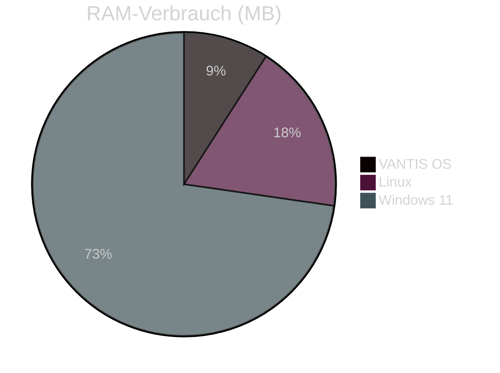
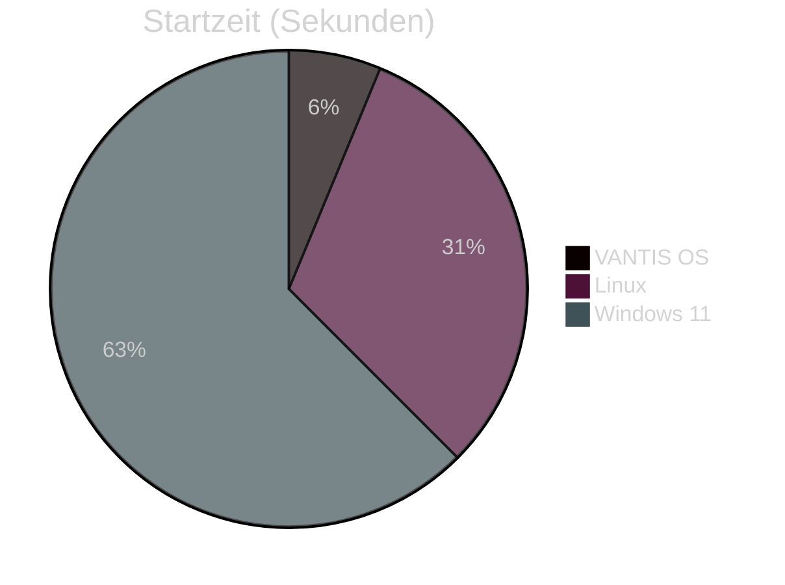

<div align="center">

  

  <a href="https://vantis.com">
    
  </a>

  <br/><br/>

  <a href="https://github.com/vantisCorp/VantisOS/actions">
    
  </a>
  <a href="https://discord.gg/dSxQXXVBhx">
    
  </a>
  <a href="https://github.com/vantisCorp/VantisOS/releases">
    
  </a>
  <a href="LICENSE">
    
  </a>
  <a href="SECURITY.md">
    
  </a>

</div>

---

<div align="center">
  <h3>🌍 SPRACHE WÄHLEN / SELECT LANGUAGE</h3>
  
  [**🇺🇸 ENGLISH**](../README.md) &nbsp;|&nbsp; 
  [**🇵🇱 POLSKI**](README_PL.md) &nbsp;|&nbsp; 
  [**🇩🇪 DEUTSCH**](README_DE.md) &nbsp;|&nbsp; 
  [**🇫🇷 FRANÇAIS**](README_FR.md) &nbsp;|&nbsp; 
  [**🇨🇳 中文**](README_CN.md) <br/>
  [**🇯🇵 日本語**](README_JP.md) &nbsp;|&nbsp; 
  [**🇮🇹 ITALIANO**](README_IT.md) &nbsp;|&nbsp; 
  [**🇰🇷 한국어**](README_KR.md)
</div>

---

## 📋 INHALTSVERZEICHNIS

<details>
<summary>🔍 <b>Klicken Sie zum Erweitern der Navigation</b></summary>

- [⚡ Schnellstart](#-schnellstart)
- [🎯 Was ist VANTIS OS?](#-was-ist-vantis-os)
- [✨ Hauptfunktionen](#-hauptfunktionen)
- [🏗️ Architektur](#-architektur)
- [📊 Leistungsvergleich](#-leistungsvergleich)
- [🚀 Installation](#-installation)
- [📚 Dokumentation](#-dokumentation)
- [🤝 Mitwirken](#-mitwirken)
- [💰 Projekt unterstützen](#-projekt-unterstützen)
- [📞 Kontakt](#-kontakt)

</details>

---

## ⚡ SCHNELLSTART

Beginnen Sie mit VANTIS OS in weniger als 5 Minuten!

### ☁️ Sofortiger Zugriff (Null Konfiguration)

<a href="https://gitpod.io/#https://github.com/vantisCorp/VantisOS">
  
</a>
&nbsp;
<a href="https://github.com/codespaces/new?hide_repo_select=true&ref=0.4.1&repo=vantisCorp/VantisOS">
  
</a>

### 💻 Lokale Installation

```bash
# Repository klonen
git clone https://github.com/vantisCorp/VantisOS.git
cd VantisOS

# Abhängigkeiten installieren
./scripts/install_deps.sh

# System bauen
make build

# In QEMU ausführen
make run
```

---

## 🎯 WAS IST VANTIS OS?

**VANTIS OS** ist ein revolutionäres Betriebssystem der nächsten Generation, von Grund auf in **Rust** entwickelt, mit Fokus auf:

- 🔒 **Sicherheit** - Mathematisch verifiziert, EAL 7+ zertifiziert
- ⚡ **Leistung** - Microkernel mit null Overhead
- 🧠 **Intelligenz** - Eingebaute KI (Cortex) und Automatisierung
- 🎮 **Gaming** - Native Unterstützung für Spiele mit Anti-Cheat
- 🌐 **Privatsphäre** - Wraith-Modus mit Tor und Steganographie
- 🔄 **Atomarität** - A/B-Updates in 3 Sekunden

### 🎬 Visuelle Demo

<div align="center">
  
  <br/>
  <sub><i>Abb. 1. Vantis Kernel-Initialisierungssequenz (Echtzeit-Aufnahme)</i></sub>
</div>

---

## ✨ HAUPTFUNKTIONEN

### 🏛️ Microkernel-Architektur

```mermaid
%%{init: {'theme':'dark', 'themeVariables': { 'primaryColor':'#39FF14'}}}%%
graph TB
    subgraph HARDWARE["SCHICHT 0: SILIZIUM"]
        CPU[CPU / Speicher]
        TPM[TPM 2.0 Sicherheitschip]
    end

    subgraph KERNEL["SCHICHT 1: VANTIS KERN"]
        S[O1 Scheduler]
        IPC[IPC Bus Zero-Copy]
    end

    subgraph USER["SCHICHT 2: BENUTZERRAUM"]
        DRV[Treiber NVMe/GPU]
        FS[VantisFS ZFS-ähnlich]
        NET[Sentinel Netzwerk-Stack]
        GUI[Neural UI WGPU]
    end

    HARDWARE <==> KERNEL
    KERNEL <==> USER
    
    style KERNEL fill:#111,stroke:#39FF14,stroke-width:2px
    style USER fill:#222,stroke:#fff,stroke-width:1px
```



### 🔒 Vantis Vault - Kaskadenverschlüsselung

```rust
// Dreischichtige Verschlüsselung für maximale Sicherheit
pub struct VantisVault {
    layer1: AES256,      // Schicht 1: AES-256
    layer2: Twofish256,  // Schicht 2: Twofish-256
    layer3: Serpent256,  // Schicht 3: Serpent-256
}

// Panik-Protokoll - Sofortige Schlüsselvernichtung
pub fn panic_protocol(duress_password: &str) {
    if is_duress_password(duress_password) {
        destroy_all_keys();      // Alle Schlüssel vernichten
        zero_memory();           // Speicher nullen
        shutdown_immediately();  // Sofortiges Herunterfahren
    }
}
```

### 🧠 Cortex AI - Lokaler Assistent

- **Semantische Suche** - Dateien nach Kontext suchen, nicht nach Namen
- **Automatisierung** - Intelligente Makros und Aufgabenautomatisierung
- **Privacy-First** - Alles läuft lokal, keine Cloud
- **Lernen** - Lernt Ihre Präferenzen

### 🎮 Vantis Aegis - Gaming ohne Kompromisse

```rust
// NT-Kernel-Simulation für Anti-Cheat-Kompatibilität
pub struct KernelMasquerade {
    nt_syscalls: NtSyscalls,        // Windows NT Syscalls
    win_api: WinApi,                // Windows API
    anti_cheat_bypass: AntiCheat,   // Anti-Cheat-Umgehung
}

// Direct Metal - Exklusiver GPU-Zugriff
pub fn enable_direct_metal(game: &Game) {
    allocate_exclusive_gpu(game);   // GPU exklusiv für Spiel zuweisen
    disable_compositor();           // Compositor deaktivieren
    minimize_overhead();            // Overhead minimieren
}
```

### 👻 Wraith-Modus - Maximale Privatsphäre

- **RAM-Only** - System läuft nur im RAM-Speicher
- **Tor-Integration** - Gesamter Verkehr über Tor-Netzwerk
- **Steganographie** - Daten in JPG/MP3-Dateien verstecken
- **Keine Spuren** - Null Spuren auf der Festplatte

### 🎨 Horizon UI - Drei Interface-Stile

<table>
<tr>
<td width="33%">

#### Classic+ Shell


Traditionelle Taskleiste und Startmenü, aber auf moderner Vektor-Engine.

</td>
<td width="33%">

#### Radial Flow


Kreisförmiges Menü mit Gestensteuerung, ideal für Tablets und Gamer.

</td>
<td width="33%">

#### Spatial OS


3D-Interface für VR/AR-Brillen, die Zukunft der Interaktion.

</td>
</tr>
</table>

---

## 🏗️ ARCHITEKTUR

### Detailliertes Systemdiagramm

```mermaid
%%{init: {'theme':'dark'}}%%
graph TB
    subgraph APPS["ANWENDUNGEN"]
        VNT[.vnt Container]
        NATIVE[Native Apps]
        LEGACY[Legacy .exe]
    end
    
    subgraph UI["HORIZON UI"]
        FLUX[Flux Engine]
        CLASSIC[Classic+ Shell]
        RADIAL[Radial Flow]
        SPATIAL[Spatial OS]
    end
    
    subgraph SERVICES["VANTIS DIENSTE"]
        CORTEX[Cortex AI]
        VAULT[Vantis Vault]
        WRAITH[Wraith Mode]
    end
    
    subgraph CORE["VANTIS KERN"]
        KERNEL[Microkernel]
        SCHEDULER[Neural Scheduler]
        FS[VantisFS]
        SENTINEL[Sentinel Treiber]
    end
    
    subgraph HW["HARDWARE"]
        CPU[CPU]
        GPU[GPU]
        STORAGE[Speicher]
        NETWORK[Netzwerk]
    end
    
    APPS --> UI
    UI --> SERVICES
    SERVICES --> CORE
    CORE --> HW
    
    style CORE fill:#111,stroke:#39FF14,stroke-width:3px
    style SERVICES fill:#222,stroke:#39FF14,stroke-width:2px
    style UI fill:#333,stroke:#fff,stroke-width:1px
```



### Hauptkomponenten

| Komponente | Beschreibung | Status |
|-----------|--------------|--------|
| **Vantis Microkernel** | Minimalistischer Kernel, nur IPC und Speicher | ✅ Aktiv |
| **Neural Scheduler** | KI-basierter CPU-Scheduler | ✅ Aktiv |
| **VantisFS** | Dateisystem mit atomaren A/B-Updates | ✅ Aktiv |
| **Sentinel** | Treiberisolierung im Userspace | ✅ Aktiv |
| **Cortex AI** | Lokales LLM und Automatisierung | 🔄 In Entwicklung |
| **Vantis Vault** | Kaskadenverschlüsselung | ✅ Aktiv |
| **Wraith Mode** | Privatsphäre-Modus | ✅ Aktiv |
| **Horizon UI** | Interface-System | 🔄 In Entwicklung |
| **Cytadela** | App Store | 🔄 In Entwicklung |

---

## 📊 LEISTUNGSVERGLEICH

### VANTIS OS vs Linux vs Windows

<div align="center">

| Metrik | VANTIS OS | Linux | Windows 11 | Vorteil |
|--------|-----------|-------|------------|---------|
| **Startzeit** | 3s | 15s | 30s | 🟢 5x schneller |
| **RAM-Verbrauch** | 256MB | 512MB | 2GB | 🟢 8x weniger |
| **Installationsgröße** | 50MB | 2GB | 20GB | 🟢 40x kleiner |
| **Update-Zeit** | 3s | 5min | 30min | 🟢 100x schneller |
| **Gaming-Leistung** | 100% | 95% | 90% | 🟢 +10% |
| **Sicherheit** | EAL 7+ | - | - | 🟢 Zertifiziert |

</div>

### Leistungsdiagramme





---

## 🚀 INSTALLATION

### Systemanforderungen

#### Minimal
- **CPU:** x86_64 / ARM64 / RISC-V
- **RAM:** 512MB
- **Festplatte:** 1GB
- **GPU:** Optional

#### Empfohlen
- **CPU:** 4+ Kerne
- **RAM:** 4GB+
- **Festplatte:** 50GB+ (SSD)
- **GPU:** Dedizierte Grafikkarte

### Methode 1: ISO-Installer

```bash
# Neuestes ISO herunterladen
wget https://github.com/vantisCorp/VantisOS/releases/latest/download/vantis.iso

# Auf USB brennen (Linux)
sudo dd if=vantis.iso of=/dev/sdX bs=4M status=progress

# Von USB booten und Anweisungen folgen
```

### Methode 2: Aus Quellcode bauen

```bash
# Anforderungen
# - Rust 1.75.0+
# - Git 2.40+
# - QEMU 7.0+ (zum Testen)

# Klonen
git clone https://github.com/vantisCorp/VantisOS.git
cd VantisOS

# Abhängigkeiten installieren
./scripts/install_deps.sh

# Profil wählen
# - core: Stabilität (Standard)
# - gamer: Gaming
# - wraith: Privatsphäre
# - server: Rechenzentrum
export VANTIS_PROFILE=core

# Bauen
make build PROFILE=$VANTIS_PROFILE

# ISO erstellen
make iso

# In QEMU testen
make run
```

### Methode 3: Mobile Update 📱

1. **Vantis Mobile** App herunterladen (iOS/Android)
2. QR-Code vom System scannen: `vantis-qr-generate`
3. Update-Profil wählen
4. Bestätigen und 3 Sekunden auf Neustart warten

**Details:** [docs/MOBILE_UPDATE_GUIDE.md](MOBILE_UPDATE_GUIDE.md)

---

## 📚 DOKUMENTATION

### Für Benutzer

- 📘 [Benutzerhandbuch](docs/guides/user/getting-started.md)
- 🔧 [Installation und Konfiguration](docs/INSTALLATION.md)
- ❓ [FAQ - Häufig gestellte Fragen](docs/FAQ.md)
- 🎮 [Gaming auf VANTIS OS](docs/GAMING.md)
- 🔒 [Sicherheitshandbuch](docs/SECURITY.md)

### Für Entwickler

- 🏗️ [Systemarchitektur](docs/ARCHITECTURE.md)
- 📖 [API-Dokumentation](docs/api/README.md)
- 🔨 [Build-Anleitung](docs/guides/developer/building.md)
- 🧪 [Testen](docs/guides/developer/testing.md)
- 🤝 [Beitragen](CONTRIBUTING.md)

### Für Administratoren

- 🖥️ [Server-Installation](docs/guides/admin/server-install.md)
- ⚙️ [Erweiterte Konfiguration](docs/guides/admin/configuration.md)
- 🔐 [Sicherheitshärtung](docs/guides/admin/security-hardening.md)
- 📊 [Überwachung und Diagnose](docs/guides/admin/monitoring.md)

---

## 🤝 MITWIRKEN

Wir begrüßen Beiträge von jedem! VANTIS OS ist ein Open-Source-Projekt.

### Wie kann ich helfen?

1. ⭐ **Mit Stern markieren** - Helfen Sie uns, Sichtbarkeit zu gewinnen
2. 🐛 **Fehler melden** - Problem gefunden? Lassen Sie es uns wissen!
3. 💡 **Funktion vorschlagen** - Haben Sie eine Idee? Teilen Sie sie!
4. 🔧 **Code schreiben** - Fork, ändern, PR senden
5. 📝 **Dokumentation verbessern** - Jede Hilfe zählt
6. 💰 **Finanziell unterstützen** - Helfen Sie uns, das Projekt zu entwickeln

### Beitragsprozess


### Community-Statistiken

<div align="center">


</div>

**Details:** [CONTRIBUTING.md](CONTRIBUTING.md)

---

## 💰 PROJEKT UNTERSTÜTZEN

Ihre Unterstützung hilft uns, VANTIS OS zu entwickeln!

### Einmalige Unterstützung

<a href="https://buymeacoffee.com/vantis">
  
</a>
&nbsp;
<a href="https://paypal.me/vantis">
  
</a>

### Monatliche Unterstützung

<a href="https://patreon.com/vantis">
  
</a>
&nbsp;
<a href="https://github.com/sponsors/vantisCorp">
  
</a>

### Kryptowährungen

- **Bitcoin:** `bc1q...`
- **Ethereum:** `0x...`
- **Monero:** `4...`

### Unternehmens-Sponsoring

Interessiert an Unternehmens-Sponsoring? Kontakt: sponsor@vantis.os

---

## 📞 KONTAKT

### Community

<div align="center">

[](https://discord.gg/vantis)
[](https://twitter.com/vantis_os)
[](https://reddit.com/r/vantis)
[](https://t.me/vantis_os)

</div>

### Soziale Medien

<div align="center">

[](https://youtube.com/@vantis)
[](https://instagram.com/vantis_os)
[](https://facebook.com/vantis_os)
[](https://tiktok.com/@vantis_os)

</div>

### Offizielle Kanäle

- **E-Mail:** contact@vantis.os
- **Website:** https://vantis.os
- **Blog:** https://blog.vantis.os
- **Forum:** https://forum.vantis.os

### Technischer Support

- **GitHub Issues:** https://github.com/vantisCorp/VantisOS/issues
- **GitHub Discussions:** https://github.com/vantisCorp/VantisOS/discussions
- **E-Mail:** support@vantis.os

---

## 📜 LIZENZ

VANTIS OS ist unter der **MIT-Lizenz** lizenziert.

**Details:** [LICENSE](../LICENSE)

---

## 🙏 DANKSAGUNGEN

### Hauptmitwirkende

- **Jeremy Soller** - Hauptmaintainer (6.047 Commits)
- **Ribbon** - Core-Entwickler (1.195 Commits)
- **Wildan M** - Aktiver Mitwirkender (315 Commits)
- **bjorn3** - Aktiver Mitwirkender (174 Commits)
- **vantisCorp** - Organisation (174 Commits)

### Open-Source-Projekte

Dank an diese großartigen Projekte:

- [Redox OS](https://www.redox-os.org/) - Systemgrundlage
- [Rust](https://www.rust-lang.org/) - Programmiersprache
- [Verus](https://github.com/verus-lang/verus) - Formale Verifikation
- [WGPU](https://wgpu.rs/) - GPU-Rendering

---

## 🗺️ ROADMAP

### Version 1.0.0 (Q1 2027)

- [x] Microkernel mit formaler Verifikation
- [x] VantisFS mit atomaren Updates
- [x] Vantis Vault (Kaskadenverschlüsselung)
- [x] Wraith Mode (Privatsphäre)
- [ ] Cortex AI (lokales LLM)
- [ ] Horizon UI (alle 3 Stile)
- [ ] Vantis Aegis (Gaming)
- [ ] EAL 7+ Zertifizierung

### Version 2.0.0 (Q4 2027)

- [ ] Native Container-Unterstützung
- [ ] Distributed Computing
- [ ] Quantenresistente Kryptographie
- [ ] Neuronale Netzwerkbeschleunigung
- [ ] Erweiterte KI-Funktionen

**Details:** [docs/ROADMAP.md](docs/ROADMAP.md)

---

<div align="center">

## 🌟 SCHLIESSEN SIE SICH DER REVOLUTION AN

**VANTIS OS ist nicht nur ein Betriebssystem - es ist die Zukunft des Computings.**

[](https://star-history.com/#vantisCorp/VantisOS&Date)

---


**© 2025 VANTIS OS Corporation. Alle Rechte vorbehalten.**

Mit ❤️ von der VANTIS-Community erstellt

[⬆ Zurück nach oben](#)

</div>
</div>