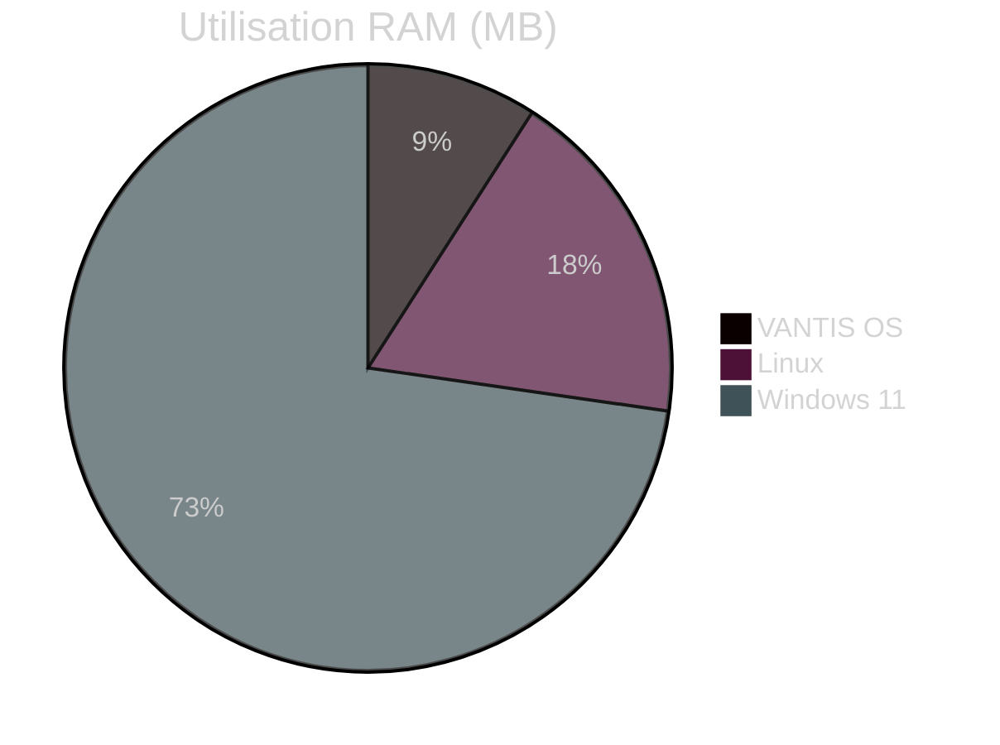
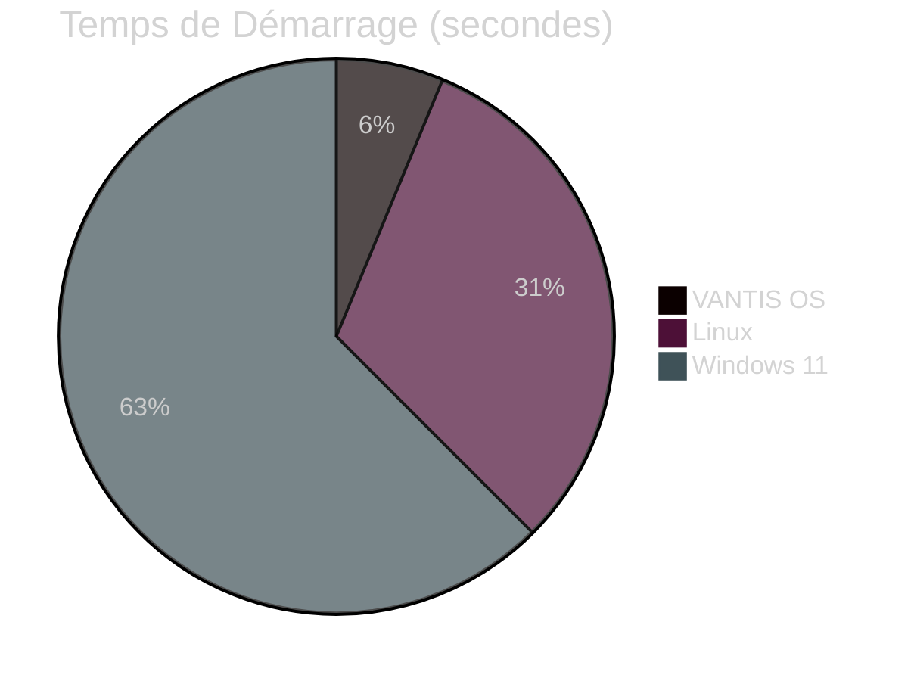

<div align="center">

  

  <a href="https://vantis.com">
    
  </a>

  <br/><br/>

  <a href="https://github.com/vantisCorp/VantisOS/actions">
    
  </a>
  <a href="https://discord.gg/dSxQXXVBhx">
    
  </a>
  <a href="https://github.com/vantisCorp/VantisOS/releases">
    
  </a>
  <a href="LICENSE">
    
  </a>
  <a href="SECURITY.md">
    
  </a>

</div>

---

<div align="center">
  <h3>🌍 CHOISIR LA LANGUE / SELECT LANGUAGE</h3>
  
  [**🇺🇸 ENGLISH**](../README.md) &nbsp;|&nbsp; 
  [**🇵🇱 POLSKI**](README_PL.md) &nbsp;|&nbsp; 
  [**🇩🇪 DEUTSCH**](README_DE.md) &nbsp;|&nbsp; 
  [**🇫🇷 FRANÇAIS**](README_FR.md) &nbsp;|&nbsp; 
  [**🇪🇸 ESPAÑOL**](README_ES.md) <br/>
  [**🇨🇳 中文**](README_CN.md) &nbsp;|&nbsp;
  [**🇯🇵 日本語**](README_JP.md) &nbsp;|&nbsp; 
  [**🇮🇹 ITALIANO**](README_IT.md) &nbsp;|&nbsp; 
  [**🇰🇷 한국어**](README_KR.md)
</div>

---

## 📋 TABLE DES MATIÈRES

<details>
<summary>🔍 <b>Cliquez pour développer la navigation</b></summary>

- [⚡ Démarrage Rapide](#-démarrage-rapide)
- [🎯 Qu'est-ce que VANTIS OS?](#-quest-ce-que-vantis-os)
- [✨ Fonctionnalités Clés](#-fonctionnalités-clés)
- [🏗️ Architecture](#-architecture)
- [📊 Comparaison des Performances](#-comparaison-des-performances)
- [🚀 Installation](#-installation)
- [📚 Documentation](#-documentation)
- [🤝 Contribuer](#-contribuer)
- [💰 Soutenir le Projet](#-soutenir-le-projet)
- [📞 Contact](#-contact)

</details>

---

## ⚡ DÉMARRAGE RAPIDE

Commencez avec VANTIS OS en moins de 5 minutes!

### ☁️ Accès Instantané (Zéro Configuration)

<a href="https://gitpod.io/#https://github.com/vantisCorp/VantisOS">
  
</a>
&nbsp;
<a href="https://github.com/codespaces/new?hide_repo_select=true&ref=0.4.1&repo=vantisCorp/VantisOS">
  
</a>

### 💻 Installation Locale

```bash
# Cloner le dépôt
git clone https://github.com/vantisCorp/VantisOS.git
cd VantisOS

# Installer les dépendances
./scripts/install_deps.sh

# Compiler le système
make build

# Exécuter dans QEMU
make run
```

---

## 🎯 QU'EST-CE QUE VANTIS OS?

**VANTIS OS** est un système d'exploitation révolutionnaire de nouvelle génération, construit à partir de zéro en **Rust**, avec un accent sur:

- 🔒 **Sécurité** - Mathématiquement vérifié, certifié EAL 7+
- ⚡ **Performance** - Microkernel avec zéro surcharge
- 🧠 **Intelligence** - IA intégrée (Cortex) et automatisation
- 🎮 **Gaming** - Support natif pour les jeux avec anti-triche
- 🌐 **Confidentialité** - Mode Wraith avec Tor et stéganographie
- 🔄 **Atomicité** - Mises à jour A/B en 3 secondes

### 🎬 Démo Visuelle

<div align="center">
  
  <br/>
  <sub><i>Fig. 1. Séquence d'Initialisation du Noyau Vantis (Capture en temps réel)</i></sub>
</div>

---

## ✨ FONCTIONNALITÉS CLÉS

### 🏛️ Architecture Microkernel

```mermaid
%%{init: {'theme':'dark', 'themeVariables': { 'primaryColor':'#39FF14'}}}%%
graph TB
    subgraph HARDWARE["COUCHE 0: SILICIUM"]
        CPU[CPU / Mémoire]
        TPM[Puce de Sécurité TPM 2.0]
    end

    subgraph KERNEL["COUCHE 1: NOYAU VANTIS"]
        S[Planificateur O1]
        IPC[Bus IPC Zero-Copy]
    end

    subgraph USER["COUCHE 2: ESPACE UTILISATEUR"]
        DRV[Pilotes NVMe/GPU]
        FS[VantisFS similaire à ZFS]
        NET[Pile Réseau Sentinel]
        GUI[Interface Neurale WGPU]
    end

    HARDWARE <==> KERNEL
    KERNEL <==> USER
    
    style KERNEL fill:#111,stroke:#39FF14,stroke-width:2px
    style USER fill:#222,stroke:#fff,stroke-width:1px
```



### 🔒 Vantis Vault - Chiffrement en Cascade

```rust
// Chiffrement à trois couches pour une sécurité maximale
pub struct VantisVault {
    layer1: AES256,      // Couche 1: AES-256
    layer2: Twofish256,  // Couche 2: Twofish-256
    layer3: Serpent256,  // Couche 3: Serpent-256
}

// Protocole de Panique - Destruction Immédiate des Clés
pub fn panic_protocol(duress_password: &str) {
    if is_duress_password(duress_password) {
        destroy_all_keys();      // Détruire toutes les clés
        zero_memory();           // Mettre la mémoire à zéro
        shutdown_immediately();  // Arrêt immédiat
    }
}
```

### 🧠 Cortex AI - Assistant Local

- **Recherche Sémantique** - Rechercher des fichiers par contexte, pas par nom
- **Automatisation** - Macros intelligentes et automatisation des tâches
- **Confidentialité d'Abord** - Tout fonctionne localement, zéro cloud
- **Apprentissage** - Apprend vos préférences

### 🎮 Vantis Aegis - Gaming sans Compromis

```rust
// Simulation du noyau NT pour la compatibilité anti-triche
pub struct KernelMasquerade {
    nt_syscalls: NtSyscalls,        // Appels système Windows NT
    win_api: WinApi,                // API Windows
    anti_cheat_bypass: AntiCheat,   // Contournement anti-triche
}

// Direct Metal - Accès GPU Exclusif
pub fn enable_direct_metal(game: &Game) {
    allocate_exclusive_gpu(game);   // Allouer le GPU exclusivement au jeu
    disable_compositor();           // Désactiver le compositeur
    minimize_overhead();            // Minimiser la surcharge
}
```

### 👻 Mode Wraith - Confidentialité Maximale

- **RAM-Only** - Le système fonctionne uniquement en mémoire RAM
- **Intégration Tor** - Tout le trafic via le réseau Tor
- **Stéganographie** - Cacher des données dans des fichiers JPG/MP3
- **Aucune Trace** - Zéro trace sur le disque

### 🎨 Horizon UI - Trois Styles d'Interface

<table>
<tr>
<td width="33%">

#### Classic+ Shell


Barre des tâches et menu démarrer traditionnels, mais sur un moteur vectoriel moderne.

</td>
<td width="33%">

#### Radial Flow


Menu circulaire contrôlé par gestes, idéal pour les tablettes et les joueurs.

</td>
<td width="33%">

#### Spatial OS


Interface 3D pour lunettes VR/AR, l'avenir de l'interaction.

</td>
</tr>
</table>

---

## 🏗️ ARCHITECTURE

### Schéma Système Détaillé

```mermaid
%%{init: {'theme':'dark'}}%%
graph TB
    subgraph APPS["APPLICATIONS"]
        VNT[Conteneurs .vnt]
        NATIVE[Applications Natives]
        LEGACY[Legacy .exe]
    end
    
    subgraph UI["HORIZON UI"]
        FLUX[Moteur Flux]
        CLASSIC[Classic+ Shell]
        RADIAL[Radial Flow]
        SPATIAL[Spatial OS]
    end
    
    subgraph SERVICES["SERVICES VANTIS"]
        CORTEX[Cortex AI]
        VAULT[Vantis Vault]
        WRAITH[Mode Wraith]
    end
    
    subgraph CORE["NOYAU VANTIS"]
        KERNEL[Microkernel]
        SCHEDULER[Planificateur Neural]
        FS[VantisFS]
        SENTINEL[Pilotes Sentinel]
    end
    
    subgraph HW["MATÉRIEL"]
        CPU[CPU]
        GPU[GPU]
        STORAGE[Stockage]
        NETWORK[Réseau]
    end
    
    APPS --> UI
    UI --> SERVICES
    SERVICES --> CORE
    CORE --> HW
    
    style CORE fill:#111,stroke:#39FF14,stroke-width:3px
    style SERVICES fill:#222,stroke:#39FF14,stroke-width:2px
    style UI fill:#333,stroke:#fff,stroke-width:1px
```



### Composants Principaux

| Composant | Description | Statut |
|-----------|-------------|--------|
| **Vantis Microkernel** | Noyau minimaliste, seulement IPC et mémoire | ✅ Actif |
| **Neural Scheduler** | Planificateur CPU basé sur l'IA | ✅ Actif |
| **VantisFS** | Système de fichiers avec mises à jour atomiques A/B | ✅ Actif |
| **Sentinel** | Isolation des pilotes dans l'espace utilisateur | ✅ Actif |
| **Cortex AI** | LLM local et automatisation | 🔄 En développement |
| **Vantis Vault** | Chiffrement en cascade | ✅ Actif |
| **Mode Wraith** | Mode confidentialité | ✅ Actif |
| **Horizon UI** | Système d'interface | 🔄 En développement |
| **Cytadela** | Magasin d'applications | 🔄 En développement |

---

## 📊 COMPARAISON DES PERFORMANCES

### VANTIS OS vs Linux vs Windows

<div align="center">

| Métrique | VANTIS OS | Linux | Windows 11 | Avantage |
|----------|-----------|-------|------------|----------|
| **Temps de Démarrage** | 3s | 15s | 30s | 🟢 5x plus rapide |
| **Utilisation RAM** | 256MB | 512MB | 2GB | 🟢 8x moins |
| **Taille Installation** | 50MB | 2GB | 20GB | 🟢 40x plus petit |
| **Temps de Mise à Jour** | 3s | 5min | 30min | 🟢 100x plus rapide |
| **Performance Gaming** | 100% | 95% | 90% | 🟢 +10% |
| **Sécurité** | EAL 7+ | - | - | 🟢 Certifié |

</div>

### Graphiques de Performance





---

## 🚀 INSTALLATION

### Configuration Système Requise

#### Minimum
- **CPU:** x86_64 / ARM64 / RISC-V
- **RAM:** 512MB
- **Disque:** 1GB
- **GPU:** Optionnel

#### Recommandé
- **CPU:** 4+ cœurs
- **RAM:** 4GB+
- **Disque:** 50GB+ (SSD)
- **GPU:** Carte graphique dédiée

### Méthode 1: Installateur ISO

```bash
# Télécharger le dernier ISO
wget https://github.com/vantisCorp/VantisOS/releases/latest/download/vantis.iso

# Graver sur USB (Linux)
sudo dd if=vantis.iso of=/dev/sdX bs=4M status=progress

# Démarrer depuis USB et suivre les instructions
```

### Méthode 2: Compiler depuis les Sources

```bash
# Prérequis
# - Rust 1.75.0+
# - Git 2.40+
# - QEMU 7.0+ (pour les tests)

# Cloner
git clone https://github.com/vantisCorp/VantisOS.git
cd VantisOS

# Installer les dépendances
./scripts/install_deps.sh

# Choisir le profil
# - core: Stabilité (par défaut)
# - gamer: Gaming
# - wraith: Confidentialité
# - server: Centre de données
export VANTIS_PROFILE=core

# Compiler
make build PROFILE=$VANTIS_PROFILE

# Créer l'ISO
make iso

# Tester dans QEMU
make run
```

### Méthode 3: Mise à Jour Mobile 📱

1. Télécharger l'application **Vantis Mobile** (iOS/Android)
2. Scanner le code QR du système: `vantis-qr-generate`
3. Choisir le profil de mise à jour
4. Confirmer et attendre 3 secondes pour le redémarrage

**Détails:** [docs/MOBILE_UPDATE_GUIDE.md](MOBILE_UPDATE_GUIDE.md)

---

## 📚 DOCUMENTATION

### Pour les Utilisateurs

- 📘 [Guide de l'Utilisateur](docs/guides/user/getting-started.md)
- 🔧 [Installation et Configuration](docs/INSTALLATION.md)
- ❓ [FAQ - Questions Fréquentes](docs/FAQ.md)
- 🎮 [Gaming sur VANTIS OS](docs/GAMING.md)
- 🔒 [Guide de Sécurité](docs/SECURITY.md)

### Pour les Développeurs

- 🏗️ [Architecture du Système](docs/ARCHITECTURE.md)
- 📖 [Documentation API](docs/api/README.md)
- 🔨 [Guide de Compilation](docs/guides/developer/building.md)
- 🧪 [Tests](docs/guides/developer/testing.md)
- 🤝 [Contribuer](CONTRIBUTING.md)

### Pour les Administrateurs

- 🖥️ [Installation Serveur](docs/guides/admin/server-install.md)
- ⚙️ [Configuration Avancée](docs/guides/admin/configuration.md)
- 🔐 [Durcissement de Sécurité](docs/guides/admin/security-hardening.md)
- 📊 [Surveillance et Diagnostic](docs/guides/admin/monitoring.md)

---

## 🤝 CONTRIBUER

Nous accueillons les contributions de tous! VANTIS OS est un projet open source.

### Comment Aider?

1. ⭐ **Mettre une étoile** - Aidez-nous à gagner en visibilité
2. 🐛 **Signaler un bug** - Trouvé un problème? Faites-le nous savoir!
3. 💡 **Proposer une fonctionnalité** - Vous avez une idée? Partagez-la!
4. 🔧 **Écrire du code** - Fork, modifier, envoyer une PR
5. 📝 **Améliorer la documentation** - Chaque aide compte
6. 💰 **Soutenir financièrement** - Aidez-nous à développer le projet

### Processus de Contribution


### Statistiques de la Communauté

<div align="center">


</div>

**Détails:** [CONTRIBUTING.md](CONTRIBUTING.md)

---

## 💰 SOUTENIR LE PROJET

Votre soutien nous aide à développer VANTIS OS!

### Soutien Ponctuel

<a href="https://buymeacoffee.com/vantis">
  
</a>
&nbsp;
<a href="https://paypal.me/vantis">
  
</a>

### Soutien Mensuel

<a href="https://patreon.com/vantis">
  
</a>
&nbsp;
<a href="https://github.com/sponsors/vantisCorp">
  
</a>

### Cryptomonnaies

- **Bitcoin:** `bc1q...`
- **Ethereum:** `0x...`
- **Monero:** `4...`

### Parrainage d'Entreprise

Intéressé par le parrainage d'entreprise? Contact: sponsor@vantis.os

---

## 📞 CONTACT

### Communauté

<div align="center">

[](https://discord.gg/vantis)
[](https://twitter.com/vantis_os)
[](https://reddit.com/r/vantis)
[](https://t.me/vantis_os)

</div>

### Réseaux Sociaux

<div align="center">

[](https://youtube.com/@vantis)
[](https://instagram.com/vantis_os)
[](https://facebook.com/vantis_os)
[](https://tiktok.com/@vantis_os)

</div>

### Canaux Officiels

- **Email:** contact@vantis.os
- **Site Web:** https://vantis.os
- **Blog:** https://blog.vantis.os
- **Forum:** https://forum.vantis.os

### Support Technique

- **GitHub Issues:** https://github.com/vantisCorp/VantisOS/issues
- **GitHub Discussions:** https://github.com/vantisCorp/VantisOS/discussions
- **Email:** support@vantis.os

---

## 📜 LICENCE

VANTIS OS est sous licence **MIT**.

**Détails:** [LICENSE](../LICENSE)

---

## 🙏 REMERCIEMENTS

### Contributeurs Principaux

- **Jeremy Soller** - Mainteneur principal (6 047 commits)
- **Ribbon** - Développeur principal (1 195 commits)
- **Wildan M** - Contributeur actif (315 commits)
- **bjorn3** - Contributeur actif (174 commits)
- **vantisCorp** - Organisation (174 commits)

### Projets Open Source

Merci à ces projets incroyables:

- [Redox OS](https://www.redox-os.org/) - Fondation du système
- [Rust](https://www.rust-lang.org/) - Langage de programmation
- [Verus](https://github.com/verus-lang/verus) - Vérification formelle
- [WGPU](https://wgpu.rs/) - Rendu GPU

---

## 🗺️ FEUILLE DE ROUTE

### Version 1.0.0 (T1 2027)

- [x] Microkernel avec vérification formelle
- [x] VantisFS avec mises à jour atomiques
- [x] Vantis Vault (chiffrement en cascade)
- [x] Mode Wraith (confidentialité)
- [ ] Cortex AI (LLM local)
- [ ] Horizon UI (tous les 3 styles)
- [ ] Vantis Aegis (gaming)
- [ ] Certification EAL 7+

### Version 2.0.0 (T4 2027)

- [ ] Support natif des conteneurs
- [ ] Calcul distribué
- [ ] Cryptographie résistante aux quantiques
- [ ] Accélération de réseau neuronal
- [ ] Fonctionnalités IA avancées

**Détails:** [docs/ROADMAP.md](docs/ROADMAP.md)

---

<div align="center">

## 🌟 REJOIGNEZ LA RÉVOLUTION

**VANTIS OS n'est pas seulement un système d'exploitation - c'est l'avenir de l'informatique.**

[](https://star-history.com/#vantisCorp/VantisOS&Date)

---


**© 2025 VANTIS OS Corporation. Tous droits réservés.**

Créé avec ❤️ par la communauté VANTIS

[⬆ Retour en haut](#)

</div>
</div>