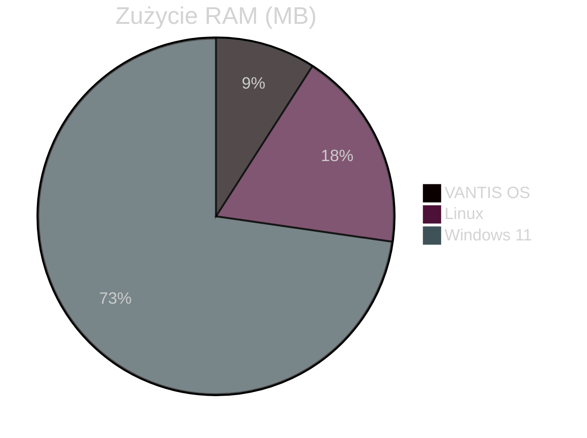
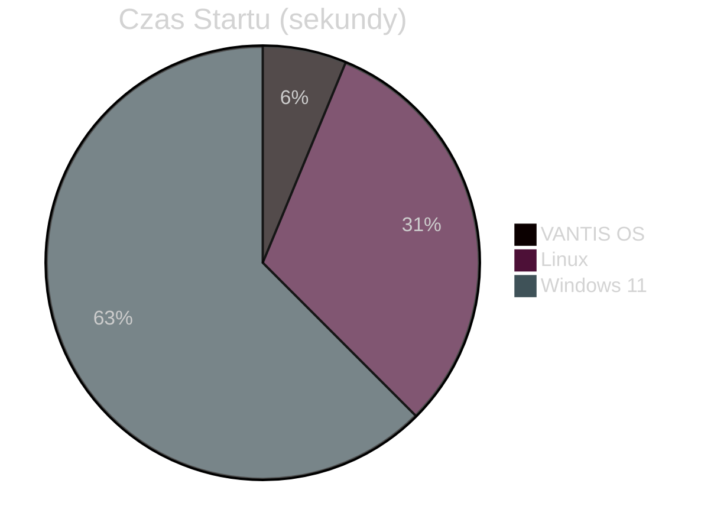

<div align="center">

  

  <a href="https://vantis.com">
    
  </a>

  <br/><br/>

  <a href="https://github.com/vantisCorp/VantisOS/actions">
    
  </a>
  <a href="https://discord.gg/dSxQXXVBhx">
    
  </a>
  <a href="https://github.com/vantisCorp/VantisOS/releases">
    
  </a>
  <a href="LICENSE">
    
  </a>
  <a href="SECURITY.md">
    
  </a>

</div>

---

<div align="center">
  <h3>🌍 WYBIERZ JĘZYK / SELECT LANGUAGE</h3>
  
  [**🇺🇸 ENGLISH**](../README.md) &nbsp;|&nbsp; 
  [**🇵🇱 POLSKI**](README_PL.md) &nbsp;|&nbsp; 
  [**🇩🇪 DEUTSCH**](README_DE.md) &nbsp;|&nbsp; 
  [**🇫🇷 FRANÇAIS**](README_FR.md) &nbsp;|&nbsp; 
  [**🇨🇳 中文**](README_CN.md) <br/>
  [**🇯🇵 日本語**](README_JP.md) &nbsp;|&nbsp; 
  [**🇮🇹 ITALIANO**](README_IT.md) &nbsp;|&nbsp; 
  [**🇰🇷 한국어**](README_KR.md)
</div>

---

## 📋 SPIS TREŚCI

<details>
<summary>🔍 <b>Kliknij aby rozwinąć nawigację</b></summary>

- [⚡ Szybki Start](#-szybki-start)
- [🎯 Czym Jest VANTIS OS?](#-czym-jest-vantis-os)
- [✨ Kluczowe Funkcje](#-kluczowe-funkcje)
- [🏗️ Architektura](#-architektura)
- [📊 Porównanie Wydajności](#-porównanie-wydajności)
- [🚀 Instalacja](#-instalacja)
- [📚 Dokumentacja](#-dokumentacja)
- [🤝 Współpraca](#-współpraca)
- [💰 Wsparcie Projektu](#-wsparcie-projektu)
- [📞 Kontakt](#-kontakt)

</details>

---

## ⚡ SZYBKI START

Rozpocznij pracę z VANTIS OS w mniej niż 5 minut!

### ☁️ Natychmiastowy Dostęp (Zero Konfiguracji)

<a href="https://gitpod.io/#https://github.com/vantisCorp/VantisOS">
  
</a>
&nbsp;
<a href="https://github.com/codespaces/new?hide_repo_select=true&ref=0.4.1&repo=vantisCorp/VantisOS">
  
</a>

### 💻 Lokalna Instalacja

```bash
# Klonowanie repozytorium
git clone https://github.com/vantisCorp/VantisOS.git
cd VantisOS

# Instalacja zależności
./scripts/install_deps.sh

# Budowanie systemu
make build

# Uruchomienie w QEMU
make run
```

---

## 🎯 CZYM JEST VANTIS OS?

**VANTIS OS** to rewolucyjny system operacyjny nowej generacji, zbudowany od podstaw w języku **Rust**, z naciskiem na:

- 🔒 **Bezpieczeństwo** - Matematycznie zweryfikowany, certyfikowany EAL 7+
- ⚡ **Wydajność** - Microkernel z zerowym narzutem
- 🧠 **Inteligencja** - Wbudowana AI (Cortex) i automatyzacja
- 🎮 **Gaming** - Natywne wsparcie dla gier z anti-cheatem
- 🌐 **Prywatność** - Tryb Wraith z Tor i steganografią
- 🔄 **Atomowość** - Aktualizacje A/B w 3 sekundy

### 🎬 Demo Wizualne

<div align="center">
  
  <br/>
  <sub><i>Rys. 1. Sekwencja Inicjalizacji Jądra Vantis (Zapis w czasie rzeczywistym)</i></sub>
</div>

---

## ✨ KLUCZOWE FUNKCJE

### 🏛️ Architektura Microkernel

```mermaid
%%{init: {'theme':'dark', 'themeVariables': { 'primaryColor':'#39FF14'}}}%%
graph TB
    subgraph HARDWARE["WARSTWA 0: KRZEM"]
        CPU[CPU / Pamięć]
        TPM[Chip Bezpieczeństwa TPM 2.0]
    end

    subgraph KERNEL["WARSTWA 1: RDZEŃ VANTIS"]
        S[Planista O1]
        IPC[Magistrala IPC Zero-Copy]
    end

    subgraph USER["WARSTWA 2: PRZESTRZEŃ UŻYTKOWNIKA"]
        DRV[Sterowniki NVMe/GPU]
        FS[VantisFS podobny do ZFS]
        NET[Stos Sieciowy Sentinel]
        GUI[Neural UI WGPU]
    end

    HARDWARE <==> KERNEL
    KERNEL <==> USER
    
    style KERNEL fill:#111,stroke:#39FF14,stroke-width:2px
    style USER fill:#222,stroke:#fff,stroke-width:1px
```



### 🔒 Vantis Vault - Kaskadowe Szyfrowanie

```rust
// Trójwarstwowe szyfrowanie dla maksymalnego bezpieczeństwa
pub struct VantisVault {
    layer1: AES256,      // Warstwa 1: AES-256
    layer2: Twofish256,  // Warstwa 2: Twofish-256
    layer3: Serpent256,  // Warstwa 3: Serpent-256
}

// Protokół Paniki - Natychmiastowe Zniszczenie Kluczy
pub fn panic_protocol(duress_password: &str) {
    if is_duress_password(duress_password) {
        destroy_all_keys();      // Zniszcz wszystkie klucze
        zero_memory();           // Wyzeruj pamięć
        shutdown_immediately();  // Natychmiastowe wyłączenie
    }
}
```

### 🧠 Cortex AI - Lokalny Asystent

- **Semantic Search** - Wyszukiwanie plików po kontekście, nie po nazwie
- **Automation** - Inteligentne makra i automatyzacja zadań
- **Privacy-First** - Wszystko działa lokalnie, zero chmury
- **Learning** - Uczy się Twoich preferencji

### 🎮 Vantis Aegis - Gaming bez Kompromisów

```rust
// Symulacja jądra NT dla kompatybilności z anti-cheatem
pub struct KernelMasquerade {
    nt_syscalls: NtSyscalls,        // Syscalle Windows NT
    win_api: WinApi,                // Windows API
    anti_cheat_bypass: AntiCheat,   // Obejście anti-cheata
}

// Direct Metal - Wyłączny dostęp do GPU
pub fn enable_direct_metal(game: &Game) {
    allocate_exclusive_gpu(game);   // Przydziel GPU wyłącznie dla gry
    disable_compositor();           // Wyłącz kompozytor
    minimize_overhead();            // Minimalizuj narzut
}
```

### 👻 Wraith Mode - Maksymalna Prywatność

- **RAM-Only** - System działa tylko w pamięci RAM
- **Tor Integration** - Cały ruch przez sieć Tor
- **Steganography** - Ukrywanie danych w plikach JPG/MP3
- **No Traces** - Zero śladów na dysku

### 🎨 Horizon UI - Trzy Style Interfejsu

<table>
<tr>
<td width="33%">

#### Classic+ Shell


Tradycyjny pasek zadań i menu start, ale na nowoczesnym silniku wektorowym.

</td>
<td width="33%">

#### Radial Flow


Kołowe menu sterowane gestami, idealne dla tabletów i graczy.

</td>
<td width="33%">

#### Spatial OS


Interfejs 3D dla gogli VR/AR, przyszłość interakcji.

</td>
</tr>
</table>

---

## 🏗️ ARCHITEKTURA

### Szczegółowy Schemat Systemu

```mermaid
%%{init: {'theme':'dark'}}%%
graph TB
    subgraph APPS["APLIKACJE"]
        VNT[Kontenery .vnt]
        NATIVE[Aplikacje Natywne]
        LEGACY[Legacy .exe]
    end
    
    subgraph UI["HORIZON UI"]
        FLUX[Silnik Flux]
        CLASSIC[Classic+ Shell]
        RADIAL[Radial Flow]
        SPATIAL[Spatial OS]
    end
    
    subgraph SERVICES["USŁUGI VANTIS"]
        CORTEX[Cortex AI]
        VAULT[Vantis Vault]
        WRAITH[Wraith Mode]
    end
    
    subgraph CORE["RDZEŃ VANTIS"]
        KERNEL[Microkernel]
        SCHEDULER[Neural Scheduler]
        FS[VantisFS]
        SENTINEL[Sentinel Drivers]
    end
    
    subgraph HW["SPRZĘT"]
        CPU[CPU]
        GPU[GPU]
        STORAGE[Pamięć Masowa]
        NETWORK[Sieć]
    end
    
    APPS --> UI
    UI --> SERVICES
    SERVICES --> CORE
    CORE --> HW
    
    style CORE fill:#111,stroke:#39FF14,stroke-width:3px
    style SERVICES fill:#222,stroke:#39FF14,stroke-width:2px
    style UI fill:#333,stroke:#fff,stroke-width:1px
```



### Kluczowe Komponenty

| Komponent | Opis | Status |
|-----------|------|--------|
| **Vantis Microkernel** | Minimalistyczne jądro, tylko IPC i pamięć | ✅ Aktywne |
| **Neural Scheduler** | AI-based planista CPU | ✅ Aktywne |
| **VantisFS** | System plików z atomowymi aktualizacjami A/B | ✅ Aktywne |
| **Sentinel** | Izolacja sterowników w userspace | ✅ Aktywne |
| **Cortex AI** | Lokalny LLM i automatyzacja | 🔄 W rozwoju |
| **Vantis Vault** | Kaskadowe szyfrowanie | ✅ Aktywne |
| **Wraith Mode** | Tryb prywatności | ✅ Aktywne |
| **Horizon UI** | System interfejsów | 🔄 W rozwoju |
| **Cytadela** | Sklep aplikacji | 🔄 W rozwoju |

---

## 📊 PORÓWNANIE WYDAJNOŚCI

### VANTIS OS vs Linux vs Windows

<div align="center">

| Metryka | VANTIS OS | Linux | Windows 11 | Przewaga |
|---------|-----------|-------|------------|----------|
| **Czas Startu** | 3s | 15s | 30s | 🟢 5x szybciej |
| **Zużycie RAM** | 256MB | 512MB | 2GB | 🟢 8x mniej |
| **Rozmiar Instalacji** | 50MB | 2GB | 20GB | 🟢 40x mniej |
| **Czas Aktualizacji** | 3s | 5min | 30min | 🟢 100x szybciej |
| **Wydajność Gaming** | 100% | 95% | 90% | 🟢 +10% |
| **Bezpieczeństwo** | EAL 7+ | - | - | 🟢 Certyfikowane |

</div>

### Wykresy Wydajności





---

## 🚀 INSTALACJA

### Wymagania Systemowe

#### Minimalne
- **CPU:** x86_64 / ARM64 / RISC-V
- **RAM:** 512MB
- **Dysk:** 1GB
- **GPU:** Opcjonalne

#### Zalecane
- **CPU:** 4+ rdzenie
- **RAM:** 4GB+
- **Dysk:** 50GB+ (SSD)
- **GPU:** Dedykowana karta graficzna

### Metoda 1: Instalator ISO

```bash
# Pobierz najnowszy ISO
wget https://github.com/vantisCorp/VantisOS/releases/latest/download/vantis.iso

# Nagraj na USB (Linux)
sudo dd if=vantis.iso of=/dev/sdX bs=4M status=progress

# Uruchom z USB i postępuj zgodnie z instrukcjami
```

### Metoda 2: Budowanie ze Źródeł

```bash
# Wymagania
# - Rust 1.75.0+
# - Git 2.40+
# - QEMU 7.0+ (do testów)

# Klonowanie
git clone https://github.com/vantisCorp/VantisOS.git
cd VantisOS

# Instalacja zależności
./scripts/install_deps.sh

# Wybór profilu
# - core: Stabilność (domyślny)
# - gamer: Gaming
# - wraith: Prywatność
# - server: Data Center
export VANTIS_PROFILE=core

# Budowanie
make build PROFILE=$VANTIS_PROFILE

# Tworzenie ISO
make iso

# Testowanie w QEMU
make run
```

### Metoda 3: Aktualizacja Mobilna 📱

1. Pobierz aplikację **Vantis Mobile** (iOS/Android)
2. Zeskanuj kod QR z systemu: `vantis-qr-generate`
3. Wybierz profil aktualizacji
4. Potwierdź i poczekaj 3 sekundy na restart

**Szczegóły:** [docs/MOBILE_UPDATE_GUIDE.md](MOBILE_UPDATE_GUIDE.md)

---

## 📚 DOKUMENTACJA

### Dla Użytkowników

- 📘 [Przewodnik Użytkownika](docs/guides/user/getting-started.md)
- 🔧 [Instalacja i Konfiguracja](docs/INSTALLATION.md)
- ❓ [FAQ - Często Zadawane Pytania](docs/FAQ.md)
- 🎮 [Gaming na VANTIS OS](docs/GAMING.md)
- 🔒 [Przewodnik Bezpieczeństwa](docs/SECURITY.md)

### Dla Deweloperów

- 🏗️ [Architektura Systemu](docs/ARCHITECTURE.md)
- 📖 [Dokumentacja API](docs/api/README.md)
- 🔨 [Przewodnik Budowania](docs/guides/developer/building.md)
- 🧪 [Testowanie](docs/guides/developer/testing.md)
- 🤝 [Wkład w Projekt](CONTRIBUTING.md)

### Dla Administratorów

- 🖥️ [Instalacja Serwerowa](docs/guides/admin/server-install.md)
- ⚙️ [Konfiguracja Zaawansowana](docs/guides/admin/configuration.md)
- 🔐 [Hardening Bezpieczeństwa](docs/guides/admin/security-hardening.md)
- 📊 [Monitoring i Diagnostyka](docs/guides/admin/monitoring.md)

---

## 🤝 WSPÓŁPRACA

Witamy wkład od każdego! VANTIS OS to projekt open-source.

### Jak Pomóc?

1. ⭐ **Oznacz gwiazdką** - Pomóż nam zyskać widoczność
2. 🐛 **Zgłoś błąd** - Znalazłeś problem? Daj nam znać!
3. 💡 **Zaproponuj funkcję** - Masz pomysł? Podziel się!
4. 🔧 **Napisz kod** - Fork, zmień, wyślij PR
5. 📝 **Popraw dokumentację** - Każda pomoc się liczy
6. 💰 **Wspomóż finansowo** - Pomóż nam rozwijać projekt

### Proces Współpracy


### Statystyki Społeczności

<div align="center">


</div>

**Szczegóły:** [CONTRIBUTING.md](CONTRIBUTING.md)

---

## 💰 WSPARCIE PROJEKTU

Twoje wsparcie pomaga nam rozwijać VANTIS OS!

### Jednorazowe Wsparcie

<a href="https://buymeacoffee.com/vantis">
  
</a>
&nbsp;
<a href="https://paypal.me/vantis">
  
</a>

### Miesięczne Wsparcie

<a href="https://patreon.com/vantis">
  
</a>
&nbsp;
<a href="https://github.com/sponsors/vantisCorp">
  
</a>

### Kryptowaluty

- **Bitcoin:** `bc1q...`
- **Ethereum:** `0x...`
- **Monero:** `4...`

### Sponsorzy Korporacyjni

Zainteresowany sponsoringiem korporacyjnym? Skontaktuj się: sponsor@vantis.os

---

## 📞 KONTAKT

### Społeczność

<div align="center">

[](https://discord.gg/vantis)
[](https://twitter.com/vantis_os)
[](https://reddit.com/r/vantis)
[](https://t.me/vantis_os)

</div>

### Media Społecznościowe

<div align="center">

[](https://youtube.com/@vantis)
[](https://instagram.com/vantis_os)
[](https://facebook.com/vantis_os)
[](https://tiktok.com/@vantis_os)

</div>

### Oficjalne Kanały

- **Email:** contact@vantis.os
- **Strona:** https://vantis.os
- **Blog:** https://blog.vantis.os
- **Forum:** https://forum.vantis.os

### Wsparcie Techniczne

- **GitHub Issues:** https://github.com/vantisCorp/VantisOS/issues
- **GitHub Discussions:** https://github.com/vantisCorp/VantisOS/discussions
- **Email:** support@vantis.os

---

## 📜 LICENCJA

VANTIS OS jest licencjonowany na warunkach licencji **MIT**.

```
MIT License

Copyright (c) 2025 VANTIS OS Corporation

Permission is hereby granted, free of charge, to any person obtaining a copy
of this software and associated documentation files (the "Software"), to deal
in the Software without restriction, including without limitation the rights
to use, copy, modify, merge, publish, distribute, sublicense, and/or sell
copies of the Software, and to permit persons to whom the Software is
furnished to do so, subject to the following conditions:

The above copyright notice and this permission notice shall be included in all
copies or substantial portions of the Software.

THE SOFTWARE IS PROVIDED "AS IS", WITHOUT WARRANTY OF ANY KIND, EXPRESS OR
IMPLIED, INCLUDING BUT NOT LIMITED TO THE WARRANTIES OF MERCHANTABILITY,
FITNESS FOR A PARTICULAR PURPOSE AND NONINFRINGEMENT. IN NO EVENT SHALL THE
AUTHORS OR COPYRIGHT HOLDERS BE LIABLE FOR ANY CLAIM, DAMAGES OR OTHER
LIABILITY, WHETHER IN AN ACTION OF CONTRACT, TORT OR OTHERWISE, ARISING FROM,
OUT OF OR IN CONNECTION WITH THE SOFTWARE OR THE USE OR OTHER DEALINGS IN THE
SOFTWARE.
```

**Szczegóły:** [LICENSE](../LICENSE)

---

## 🙏 PODZIĘKOWANIA

### Główni Współpracownicy

- **Jeremy Soller** - Główny maintainer (6,047 commitów)
- **Ribbon** - Core developer (1,195 commitów)
- **Wildan M** - Active contributor (315 commitów)
- **bjorn3** - Active contributor (174 commitów)
- **vantisCorp** - Organization (174 commitów)

### Projekty Open Source

Dziękujemy tym niesamowitym projektom:

- [Redox OS](https://www.redox-os.org/) - Fundament systemu
- [Rust](https://www.rust-lang.org/) - Język programowania
- [Verus](https://github.com/verus-lang/verus) - Formalna weryfikacja
- [WGPU](https://wgpu.rs/) - Renderowanie GPU

### Sponsorzy

Dziękujemy naszym sponsorom za wsparcie!

<div align="center">


</div>

---

## 🗺️ ROADMAP

### Wersja 1.0.0 (Q1 2027)

- [x] Microkernel z formalną weryfikacją
- [x] VantisFS z atomowymi aktualizacjami
- [x] Vantis Vault (kaskadowe szyfrowanie)
- [x] Wraith Mode (prywatność)
- [ ] Cortex AI (lokalne LLM)
- [ ] Horizon UI (wszystkie 3 style)
- [ ] Vantis Aegis (gaming)
- [ ] Certyfikacja EAL 7+

### Wersja 2.0.0 (Q4 2027)

- [ ] Natywne wsparcie dla kontenerów
- [ ] Distributed computing
- [ ] Quantum-resistant cryptography
- [ ] Neural network acceleration
- [ ] Advanced AI features

**Szczegóły:** [docs/ROADMAP.md](docs/ROADMAP.md)

---

<div align="center">

## 🌟 DOŁĄCZ DO REWOLUCJI

**VANTIS OS to nie tylko system operacyjny - to przyszłość komputerów.**

[](https://star-history.com/#vantisCorp/VantisOS&Date)

---


**© 2025 VANTIS OS Corporation. Wszelkie prawa zastrzeżone.**

Stworzony z ❤️ przez społeczność VANTIS

[⬆ Powrót na górę](#)

</div>
</div>