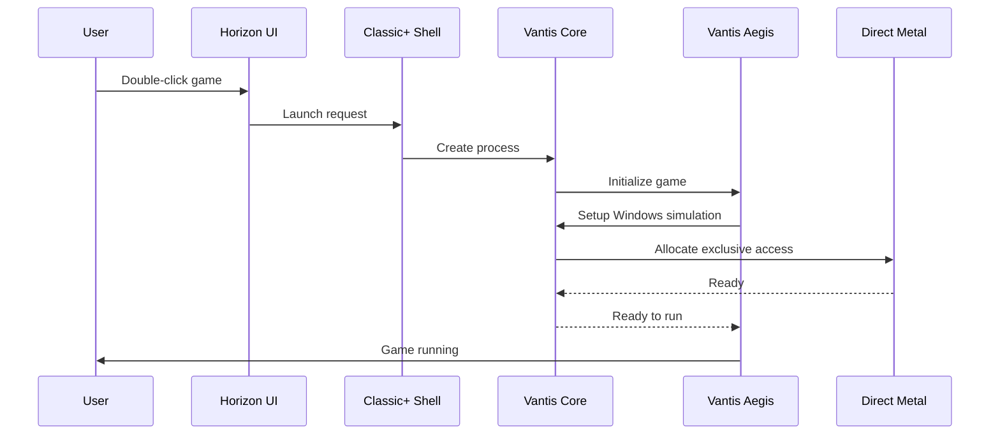

# 🏗️ Architektura VANTIS OS - Kompletna Dokumentacja

<div align="center">

[]()
[]()
[]()

**📐 Inżynieryjna Doskonałość • Matematycznie Zweryfikowana • Przyszłościowa 📐**

</div>

## 📋 Spis Treści

- [🎯 Przegląd Architektury](#-przegląd-architektury)
- [🏛️ Warstwa Architektura Systemu](#-warstwa-architektura-systemu)
- [⚙️ Komponenty Rdzenia](#-komponenty-rdzenia)
- [🛡️ Architektura Bezpieczeństwa](#-architektura-bezpieczeństwa)
- [🎮 Architektura Gaming](#-architektura-gaming)
- [🎨 Architektura Interfejsu](#-architektura-interfejsu)
- [🧠 Architektura AI](#-architektura-ai)
- [📊 Modele Danych](#-modele-danych)
- [🔄 Przepływ Danych](#-przepływ-danych)

---

## 🎯 Przegląd Architektury

### Główne Zasady Projektowe

| 🔑 Zasada | 📖 Opis | ✅ Implementacja |
|-----------|---------|------------------|
| **Minimalizm** | Tylko niezbędne funkcje w jądrze | Microkernel |
| **Formalna Weryfikacja** | Matematyczny dowód poprawności | Verus proofs |
| **Zero-Trust** | Domyślnie nie ufać niczemu | Capability-based security |
| **AI-Native** | Inteligencja wbudowana w system | Neural Scheduler |
| **Atomowość** | Niepodzielne operacje | Atomic updates |
| **Izolacja** | Kompletna separacja procesów | Sandboxing |

### Archipelag Wielowarstwowy

```
┌─────────────────────────────────────────────────────────────┐
│                    APLIKACJE (.vnt)                          │
├─────────────────────────────────────────────────────────────┤
│                   HORIZON UI (Flux Engine)                  │
├─────────────────────────────────────────────────────────────┤
│                 VANTIS SERVICES (Cortex, etc.)              │
├─────────────────────────────────────────────────────────────┤
│                   VANTIS CORE (Microkernel)                 │
├─────────────────────────────────────────────────────────────┤
│                    SENTINEL (Sterowniki)                    │
├─────────────────────────────────────────────────────────────┤
│                    SPRZĘT (Hardware)                        │
└─────────────────────────────────────────────────────────────┘
```

---

## 🏛️ Warstwa Architektury Systemu

### Warstwa 1: Aplikacje (.vnt Containers)

```rust
// Struktura kontenera .vnt
pub struct VntContainer {
    manifest: VntManifest,
    wasm_module: WasmModule,
    resources: Resources,
    permissions: PermissionCard,
    sandbox: Sandbox,
}

pub struct VntManifest {
    name: String,
    version: String,
    author: String,
    description: String,
    dependencies: Vec<Dependency>,
    permissions: Vec<Permission>,
    signature: Signature,
}

pub struct PermissionCard {
    read: Vec<Path>,
    write: Vec<Path>,
    network: NetworkPolicy,
    hardware: HardwareAccess,
    notifications: NotificationPolicy,
}
```

### Warstwa 2: Horizon UI (Flux Engine)

```rust
// Silnik renderowania wektorowego
pub struct FluxEngine {
    renderer: WgpuRenderer,
    compositor: Compositor,
    input_manager: InputManager,
    window_manager: WindowManager,
}

pub struct WgpuRenderer {
    device: wgpu::Device,
    queue: wgpu::Queue,
    surface: wgpu::Surface,
    swap_chain: wgpu::SwapChain,
}

// Shell systemu
pub enum ShellType {
    ClassicPlus,
    RadialFlow,
    SpatialOS,
}

pub trait Shell {
    fn render(&mut self, dt: f32);
    fn handle_input(&mut self, event: InputEvent);
    fn update(&mut self, dt: f32);
}
```

### Warstwa 3: VANTIS Services

```rust
// Lokalny AI (Cortex)
pub struct CortexAI {
    model: LlamaModel,
    embeddings: EmbeddingModel,
    semantic_index: SemanticIndex,
    automation_engine: AutomationEngine,
}

// Dostępność (Spectrum)
pub struct Spectrum2_0 {
    bci_driver: BciDriver,
    haptic_engine: HapticEngine,
    sign_recognizer: SignRecognizer,
    tts: TextToSpeech,
    stt: SpeechToText,
}
```

### Warstwa 4: VANTIS Core (Microkernel)

```rust
// Główna struktura jądra
pub struct VantisKernel {
    scheduler: NeuralScheduler,
    memory_manager: MemoryManager,
    ipc: IPCSystem,
    process_manager: ProcessManager,
    security: SecurityManager,
}

// Planista neuronowy
pub struct NeuralScheduler {
    model: NeuralModel,
    priority_queues: Vec<PriorityQueue>,
    cpu_cores: Vec<CpuCore>,
    load_balancer: LoadBalancer,
}

// Menedżer pamięci
pub struct MemoryManager {
    allocator: Allocator,
    virtual_memory: VirtualMemory,
    swap_manager: SwapManager,
    compression: MemoryCompression,
}
```

### Warstwa 5: Sentinel (Sterowniki)

```rust
// Abstrakcja sprzętowa
pub struct Sentinel {
    driver_manager: DriverManager,
    hardware_abstraction: HardwareAbstraction,
    sandbox: DriverSandbox,
    recovery: RecoverySystem,
}

// Menedżer sterowników
pub struct DriverManager {
    drivers: HashMap<DeviceId, Driver>,
    hotplug: HotplugManager,
    power_management: PowerManager,
}

// Izolacja sterowników
pub struct DriverSandbox {
    isolation_level: IsolationLevel,
    resource_limits: ResourceLimits,
    monitoring: MonitoringSystem,
    auto_restart: AutoRestart,
}
```

### Warstwa 6: Sprzęt

```rust
// Abstrakcja sprzętu
pub struct Hardware {
    cpu: CpuInfo,
    memory: MemoryInfo,
    gpu: GpuInfo,
    storage: Vec<StorageDevice>,
    network: Vec<NetworkInterface>,
    peripherals: Vec<Peripheral>,
}

// Fingerprinting sprzętu
pub struct HardwareFingerprint {
    cpu_id: String,
    gpu_id: String,
    motherboard_id: String,
    ram_signature: String,
    storage_serials: Vec<String>,
    network_macs: Vec<String>,
    hash: Sha256Hash,
}
```

---

## ⚙️ Komponenty Rdzenia

### 1. Vantis Microkernel

```rust
// Minimalistyczne jądro
pub struct Microkernel {
    // Tylko niezbędne funkcje
    memory: MemoryManagement,
    processes: ProcessManagement,
    ipc: InterProcessCommunication,
    // Zero sterowników w jądrze!
}

// Formalnie zweryfikowane funkcje
#[verus::verified]
pub fn schedule_process(kernel: &mut Microkernel, pid: Pid) {
    // Formalny dowód poprawności
    ensures! kernel.processes.is_scheduled(pid);
}
```

**Właściwości:**
- ✅ Formalnie zweryfikowany (Verus)
- ✅ Minimalny atak surface
- ✅ Zero sterowników w jądrze
- ✅ Izolacja procesów
- ✅ Secure IPC

### 2. Neural Scheduler

```rust
// Architektura sieci neuronowej
pub struct NeuralSchedulerModel {
    input_layer: InputLayer,     // 128 neuronów
    hidden_layers: Vec<HiddenLayer>,  // 2x256 neuronów
    output_layer: OutputLayer,   // 64 neurony
}

// Wejście sieci
pub struct SchedulingInput {
    task_priority: f32,
    task_type: TaskType,
    cpu_usage: f32,
    memory_usage: f32,
    io_activity: f32,
    deadline: Option<Duration>,
    user_importance: f32,
}

// Wyjście sieci
pub struct SchedulingOutput {
    priority: u8,
    quantum: Duration,
    cpu_core: usize,
    preemption_allowed: bool,
}
```

**Algorytm:**

```rust
pub fn schedule_task(model: &NeuralSchedulerModel, task: &Task) -> SchedulingDecision {
    // 1. Przygotuj wejście
    let input = prepare_input(task, system_state);
    
    // 2. Przez sieć neuronową
    let output = model.forward(input);
    
    // 3. Dekoduj decyzję
    let decision = decode_output(output);
    
    // 4. Zastosuj decyzję
    apply_decision(decision);
    
    // 5. Naucz się z wyniku
    model.learn(task, decision, result);
    
    decision
}
```

### 3. VantisFS

```rust
// System plików z Copy-on-Write
pub struct VantisFS {
    partition_a: Partition,
    partition_b: Partition,
    active_partition: PartitionRef,
    snapshots: Vec<Snapshot>,
    checksums: ChecksumDatabase,
}

// Aktualizacja atomowa
pub fn atomic_update(fs: &mut VantisFS, update: UpdatePackage) -> Result<()> {
    // 1. Sprawdź miejsce
    ensure_space(&update)?;
    
    // 2. Przygotuj nieaktywną partycję
    let target = fs.inactive_partition();
    prepare_partition(target)?;
    
    // 3. Zainstaluj aktualizację
    install_update(target, &update)?;
    
    // 4. Zweryfikuj
    verify_installation(target)?;
    
    // 5. Ustaw jako nową aktywną
    fs.set_active(target);
    
    // 6. Restart w 3 sekundy
    schedule_reboot(Duration::from_secs(3));
    
    Ok(())
}

// Self-healing
pub fn self_heal(fs: &mut VantisFS) {
    for file in fs.files() {
        if !verify_checksum(file) {
            repair_file(file);
        }
    }
}
```

**Właściwości:**
- ✅ Copy-on-Write
- ✅ Atomowe aktualizacje A/B
- ✅ Self-healing
- ✅ Snapshoty
- ✅ Checksumowanie
- ✅ Kompresja

### 4. Sentinel

```rust
// Izolacja sterowników
pub struct DriverSandbox {
    namespace: Namespace,
    cgroup: Cgroup,
    seccomp: Seccomp,
    capabilities: Capabilities,
}

// Auto-restart
pub fn restart_driver(driver: &mut Driver) {
    // 1. Zidentyfikuj błąd
    let error = detect_error(driver);
    
    // 2. Zapisz log
    log_error(&error);
    
    // 3. Zrestartuj w 0.5s
    sleep(Duration::from_millis(500));
    driver.restart();
    
    // 4. Przywróć stan
    restore_state(driver);
}
```

---

## 🛡️ Architektura Bezpieczeństwa

### Vantis Vault

```rust
// Kaskadowe szyfrowanie
pub struct VantisVault {
    layer1: Aes256,
    layer2: Twofish256,
    layer3: Serpent256,
    keys: KeyManager,
}

pub fn encrypt(vault: &VantisVault, data: &[u8]) -> Vec<u8> {
    // 1. AES-256
    let encrypted1 = vault.layer1.encrypt(data);
    
    // 2. Twofish-256
    let encrypted2 = vault.layer2.encrypt(&encrypted1);
    
    // 3. Serpent-256
    let encrypted3 = vault.layer3.encrypt(&encrypted2);
    
    encrypted3
}

pub fn decrypt(vault: &VantisVault, data: &[u8]) -> Vec<u8> {
    // Odwrotna kolejność
    let decrypted3 = vault.layer3.decrypt(data);
    let decrypted2 = vault.layer2.decrypt(&decrypted3);
    let decrypted1 = vault.layer1.decrypt(&decrypted2);
    
    decrypted1
}

// Panic Protocol
pub fn panic_protocol(vault: &mut VantisVault, duress_password: &str) {
    if vault.keys.is_duress_password(duress_password) {
        // Silent nuke
        vault.keys.destroy_all();
        zero_memory(vault);
        shutdown_immediately();
    }
}
```

### Wraith Mode

```rust
// Tryb RAM-only
pub fn enter_wraith_mode(system: &mut VantisSystem) {
    // 1. Załaduj system do RAM
    load_to_ram(&system.kernel);
    load_to_ram(&system.userland);
    
    // 2. Odłącz dysk
    unmount_all_disks();
    power_down_storage();
    
    // 3. Włącz Tor
    enable_tor_routing();
    
    // 4. Włącz steganografię
    enable_steganography();
    
    // 5. Zablokuj dyskowe zapisy
    block_disk_writes();
}

// Tor Integration
pub struct TorIntegration {
    tor_client: TorClient,
    dns_over_tor: DnsOverTor,
    socks_proxy: SocksProxy,
}
```

---

## 🎮 Architektura Gaming

### Vantis Aegis

```rust
// Kernel Masquerade
pub struct KernelMasquerade {
    nt_syscalls: NtSyscalls,
    win_api: WinApi,
    anti_cheat_bypass: AntiCheatBypass,
}

// Implementacja NT syscallów
pub fn implement_nt_syscall(number: u32, args: &[u64]) -> u64 {
    match number {
        0x55 => nt_create_file(args),      // ZwCreateFile
        0x56 => nt_open_file(args),        // ZwOpenFile
        0x57 => nt_read_file(args),        // ZwReadFile
        0x58 => nt_write_file(args),       // ZwWriteFile
        // ... więcej syscalli
        _ => unimplemented_syscall(number),
    }
}

// Symulacja Windows 11
pub struct WindowsSimulation {
    version: WindowsVersion,
    build_number: u32,
    registry: RegistrySimulation,
    wmi: WmiSimulation,
    services: ServiceManager,
}
```

### Direct Metal

```rust
// GPU Bypass
pub fn enable_direct_metal(game: &Game) {
    // 1. Zidentyfikuj grę
    let process = find_game_process(game);
    
    // 2. Przydziel wyłączny dostęp do GPU
    allocate_exclusive_gpu(process);
    
    // 3. Wyłącz compositor
    disable_compositor();
    
    // 4. Minimalizuj overhead
    minimize_overhead();
    
    // 5. Tryb exclusive
    enter_exclusive_mode(process);
}
```

---

## 🎨 Architektura Interfejsu

### Flux Engine

```rust
// Renderowanie wektorowe
pub struct VectorRenderer {
    shapes: Vec<Shape>,
    transforms: Vec<Transform>,
    effects: Vec<Effect>,
}

pub fn render(renderer: &VectorRenderer) -> Image {
    let mut canvas = Canvas::new(resolution);
    
    for shape in &renderer.shapes {
        let transformed = apply_transform(shape, &renderer.transforms);
        let rendered = render_shape(transformed);
        canvas.blend(rendered);
    }
    
    canvas
}

// Ray Tracing
pub fn ray_trace(scene: &Scene, ray: Ray) -> Color {
    let intersection = find_intersection(scene, ray);
    
    if let Some(hit) = intersection {
        let color = shade(hit);
        let reflection = reflect(ray, hit);
        let reflected_color = ray_trace(scene, reflection);
        
        color + reflected_color * 0.5
    } else {
        background_color(ray)
    }
}
```

### Babel Protocol

```rust
// Uniwersalny font
pub struct UniversalFont {
    glyphs: HashMap<char, Glyph>,
    variations: Vec<FontVariation>,
    fallback_chain: Vec<Font>,
}

// Polyglot AI
pub struct PolyglotAI {
    translator: TranslationModel,
    context_analyzer: ContextAnalyzer,
    ui_adapter: UIAdapter,
}

pub fn translate_ui(ai: &PolyglotAI, ui: &UI, target_lang: Language) -> UI {
    for element in ui.elements() {
        if let Some(text) = element.text() {
            let translated = ai.translate(text, target_lang);
            element.set_text(translated);
        }
    }
    
    ui
}
```

---

## 🧠 Architektura AI

### Cortex AI

```rust
// Lokalny LLM
pub struct CortexAI {
    model: LlamaModel,
    embeddings: EmbeddingModel,
    semantic_index: SemanticIndex,
}

// Semantic Search
pub fn semantic_search(ai: &CortexAI, query: &str) -> Vec<File> {
    // 1. Embed query
    let query_embedding = ai.embeddings.embed(query);
    
    // 2. Szukaj w indeksie semantycznym
    let candidates = ai.semantic_index.search(query_embedding);
    
    // 3. Rank i zwróć
    rank_results(candidates)
}

// Automation
pub fn automate(ai: &CortexAI, task: &Task) -> Action {
    // 1. Rozum zadania
    let intent = ai.understand(task);
    
    // 2. Znajdź makro
    let macro = ai.find_macro(intent);
    
    // 3. Wykonaj
    execute_macro(macro)
}
```

### Spectrum 2.0

```rust
// BCI Support
pub struct BciDriver {
    headset: BciHeadset,
    signal_processor: SignalProcessor,
    intent_classifier: IntentClassifier,
}

pub fn read_thought(bci: &BCIDriver) -> Intent {
    // 1. Pobierz sygnał
    let signal = bci.headset.read_signal();
    
    // 2. Przetwórz
    let processed = bci.signal_processor.process(signal);
    
    // 3. Klasyfikuj intencję
    let intent = bci.intent_classifier.classify(processed);
    
    intent
}
```

---

## 📊 Modele Danych

### Systemowy Model Danych

```rust
// Główna struktura danych
pub struct VantisSystem {
    kernel: VantisKernel,
    filesystem: VantisFS,
    ui: HorizonUI,
    security: SecuritySystem,
    services: Vec<Service>,
    hardware: Hardware,
}

// Event-driven architecture
pub enum SystemEvent {
    ProcessCreated(Pid),
    ProcessExited(Pid, ExitCode),
    TimerFired(TimerId),
    IoReady(IoEvent),
    NetworkPacket(Packet),
    HardwareInterrupt(Interrupt),
    UserInput(InputEvent),
    SecurityViolation(Violation),
}
```

---

## 🔄 Przepływ Danych

### Przykład: Uruchomienie Gry



---

<div align="center">

## 🎉 Architektura Kompletna!

**VANTIS OS to zintegrowany, formalnie zweryfikowany system przyszłości!**

[⬆ Powrót na górę](#-architektura-vantis-os---kompletna-dokumentacja)

**© 2025 VANTIS OS Corporation. Wszelkie prawa zastrzeżone.**

</div>
</div>