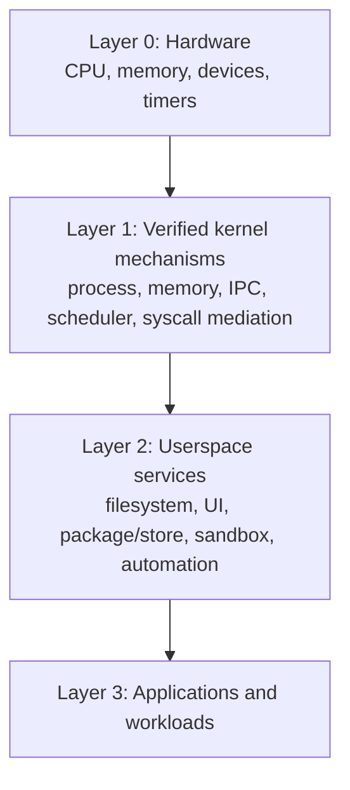
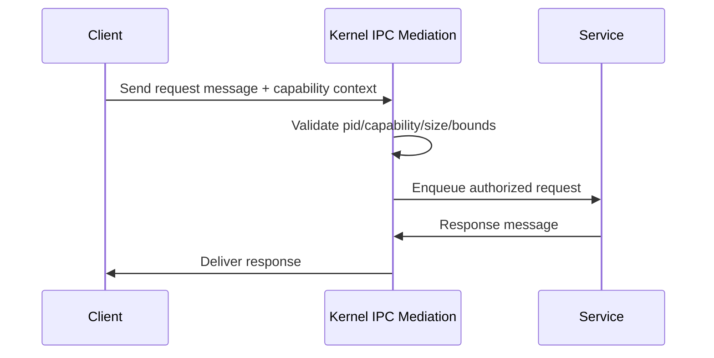

# VantisOS Microkernel Architecture

Practical architecture document for the current VantisOS codebase and near-term migration path.

**Date**: 2026-02-10  
**Scope**: Week 7-8 Day 9 deliverable  
**Audience**: kernel contributors, runtime engineers, reviewers

---

## 1) Purpose and scope

This document defines:

1. The current microkernel-oriented architecture in the repository.
2. Why key design decisions were made.
3. How the IPC-centric execution model works.
4. How this design compares with monolithic kernels.
5. The planned architecture evolution in upcoming days/weeks.

It is intentionally implementation-aligned and references real modules in:

- `src/verified/`
- `security/`
- `horizon/`
- `cytadela/`
- `cortex/`
- `store/`

---

## 2) Architecture goals

VantisOS follows a microkernel trajectory with five constraints:

1. **Minimal privileged surface**: keep kernel-side mechanisms small and auditable.
2. **IPC-first composition**: services interact through explicit message exchange.
3. **Strong isolation boundaries**: faults should be contained per component.
4. **Verification-first engineering**: critical paths carry formal/semantic safety checks.
5. **Deterministic resource behavior**: bounded queues, bounded tables, explicit errors.

---

## 3) Layered system view

### 3.1 Layer 1: verified kernel mechanisms (`src/verified`)

Primary modules:

- Process lifecycle and process table:
  - `process.rs`
- Memory and allocator primitives:
  - `memory.rs`, `allocator.rs`
- IPC and capability checks:
  - `ipc.rs` (bounded queue model and capability checks)
- Syscall namespace and trap dispatcher:
  - `syscall.rs`
- Extended syscall implementations:
  - `syscall_file_ops.rs`
  - `syscall_dir_ops.rs`
  - `syscall_advanced_ops.rs`
  - `syscall_time_ops.rs`
- Scheduling:
  - `scheduler.rs`, `scheduler_optimized.rs`, `neural_scheduler*.rs`

Design implication:

- Layer 1 stores mechanisms, not heavyweight policy.
- File/dir/fd/timer ops are already implemented with typed interfaces and are candidates for deeper trap wiring.

### 3.2 Layer 2: service space and feature modules

- Security and crypto service primitives:
  - `security/` (`vault`, `panic_protocol`, `crypto_cascade`)
- UI/compositor and shell-facing modules:
  - `horizon/`
- Application sandbox and package runtime:
  - `cytadela/`
- Local assistant/search/automation:
  - `cortex/`
- Package verification and manifest contract:
  - `store/`

Design implication:

- Service logic remains outside the minimal syscall core.
- Kernel boundary remains focused on isolation, scheduling, memory, IPC mediation, and syscall validation.

---

## 4) Kernel boundary and trust boundaries

### 4.1 What belongs in privileged kernel path

Keep in Layer 1:

1. Process state transitions and PID/parent invariants.
2. Memory safety and address/size validation.
3. IPC capability checks and queue bounds.
4. Scheduler run-queue and preemption mechanics.
5. Syscall number decoding and parameter sanitation.

### 4.2 What belongs in userspace/service layer

Move/keep in Layer 2:

1. Rich filesystem policy and higher-level namespace orchestration.
2. UI composition behavior and desktop/session policy.
3. Package ecosystem policy and store UX workflows.
4. AI workflows, intent handling, semantic indexing.
5. Compatibility shims and ecosystem adapters.

### 4.3 Fault containment model

- A service fault should not imply a kernel panic.
- Capability checks are the first line of inter-component trust control.
- Bounded resources (queue size, FD table size, timer table size) provide DoS resistance by design.

---

## 5) IPC-centric approach

IPC is not an add-on; it is the architecture centerline.

### 5.1 Why IPC-centric

1. It makes privilege boundaries explicit.
2. It isolates failures to communicating endpoints.
3. It enables capability-based access policy at message boundaries.
4. It keeps kernel responsibilities composable and auditable.

### 5.2 Current IPC characteristics (`src/verified/ipc.rs`)

- Bounded message size: `MAX_MESSAGE_SIZE = 4096`.
- Bounded queue capacity: `MAX_QUEUE_SIZE = 64`.
- Explicit capability checks (`Send`, `Receive`, `SendReceive`, `Transfer`).
- Priority-aware queue behavior.
- Formal/verification harness coverage in-module.

### 5.3 IPC-centric request lifecycle (logical)

### 5.4 Practical note on benchmark/tooling alignment

- The legacy `ipc_complete_benchmark` path is currently stale relative to the present module topology.
- Architecture intent remains IPC-centric; benchmark wiring must be migrated to maintain measurement fidelity.

---

## 6) Syscall architecture in microkernel context

### 6.1 Namespace and dispatcher

- Syscall namespace is centralized in `syscall.rs` (`SyscallNumber`).
- Dispatcher validates argument shapes and routes handlers via `SyscallHandler::dispatch`.

### 6.2 Current integration reality

Two coexist today:

1. **Trap-style dispatcher handlers** for core numbers.
2. **Typed direct interfaces** in `syscall_*_ops.rs` for extended file/dir/fd/timer operations.

This is an intentional staged migration model:

- Add feature semantics in typed modules first.
- Preserve verification and tests.
- Wire trap-dispatch paths incrementally without destabilizing interfaces.

### 6.3 Why this split is acceptable short-term

1. Keeps new functionality testable while dispatcher integration matures.
2. Avoids large, risky rewrites in one step.
3. Enables performance work (cache/bitmap/timer behavior) before ABI finalization.

---

## 7) Scheduling architecture

`scheduler_optimized.rs` demonstrates the architecture principle of simple, bounded, inspectable mechanisms:

- Priority bitmap (`PriorityBitmap`) enables O(1) highest-priority selection.
- Explicit run queues preserve task ordering semantics.
- Scheduler state is visible and benchmarkable.

Architectural impact:

- Kernel scheduling remains deterministic and measurable.
- Optimization is done in mechanism (bitmap), not by broadening privileged policy surface.

---

## 8) Security architecture alignment

Microkernel architecture and security model reinforce each other:

1. Smaller privileged surface lowers attack exposure.
2. Capability checks reduce ambient authority.
3. Strong resource bounds reduce exhaustion vectors.
4. Verification-oriented modules improve confidence in critical invariants.

Concrete repository alignment:

- `security/` holds crypto/panic protocol policy and primitives.
- `src/verified/` holds safety-critical kernel mechanisms.
- Governance and traceability map implementation to requirements and evidence artifacts.

---

## 9) Microkernel vs monolithic kernels

| Aspect | Monolithic kernel | VantisOS microkernel direction |
|---|---|---|
| Privileged code volume | Large (many subsystems in kernel space) | Reduced, mechanism-focused privileged core |
| Fault containment | A faulty kernel subsystem can destabilize whole OS | Service faults can be isolated across boundaries |
| Extensibility | Fast in-kernel call paths but broad coupling | Message-oriented composition with clearer boundaries |
| Security model | Often coarse global privilege context | Capability-mediated interactions and bounded resources |
| Verification difficulty | Higher due to broad in-kernel complexity | Lower for reduced core, still requires rigorous proofs |
| Evolution path | Feature growth often increases privileged surface | Feature growth can stay in userspace services |

Tradeoff acknowledgment:

- Monolithic designs can have lower direct call overhead in some hot paths.
- Microkernel designs require disciplined IPC and interface engineering to avoid overhead creep.
- VantisOS optimization work (path cache, bitmap FD allocator, benchmark hardening) exists to manage this tradeoff explicitly.

---

## 10) Key design decisions and rationale

### Decision A: Minimal syscall surface over POSIX-scale syscall volume

Rationale:

- Smaller ABI and dispatch surface is easier to audit and reason about.
- Compatibility strategy can live above core mechanisms.

### Decision B: Capability-mediated IPC as default coordination mechanism

Rationale:

- Prevents implicit trust channels.
- Supports clear ownership and explicit delegation rules.

### Decision C: Bounded core resources

Rationale:

- Bounded queues/tables/timers give predictable failure modes.
- Improves safety under stress and during fuzzing/verification.

### Decision D: Staged integration (typed modules first, trap wiring second)

Rationale:

- Supports continuous delivery of verified functionality.
- Reduces integration blast radius while keeping throughput on optimization tasks.

### Decision E: Verification-aware engineering

Rationale:

- Safety properties are not afterthoughts.
- Unit tests, Kani harnesses, and verification annotations remain first-class.

---

## 11) Future plans (architecture roadmap)

### Near-term (Day 10 and immediate follow-up)

1. Integration testing across syscall interaction paths.
2. Verification checks and regression gate execution.
3. Consolidation of typed syscall ops with dispatcher behavior where feasible.

### Mid-term (Days 11-12)

1. Directory-entry caching architecture and coherency refinement.
2. Timer queue data-structure optimization.
3. Measurement hardening for reproducible CI benchmarks.

### Week 9-10 direction

1. Continue transition toward IPC-only kernel responsibilities.
2. Move non-essential policy to userspace service boundaries.
3. Reduce kernel LOC and privilege footprint without losing functionality.

---

## 12) Contributor guidance: where should new functionality go?

Use this decision filter:

1. Must it run in privileged mode for correctness or security?
   - If no: place in userspace/service layer.
2. Is it a generic mechanism used by multiple services?
   - If yes: candidate for kernel mechanism.
3. Can it be expressed as message exchange with existing capabilities?
   - If yes: prefer IPC/service composition.
4. Does it increase privileged attack surface disproportionately?
   - If yes: keep out of kernel.

Practical rule:

- Add mechanisms to `src/verified`.
- Add policy/workflow to service crates/modules.
- Update architecture docs and syscall guide in the same change set.

---

## 13) Known gaps and open architecture items

1. Some syscall numbers are defined but still return stub/placeholder behavior in dispatcher.
2. Typed syscall module behavior and trap-dispatch behavior are not fully unified yet.
3. Legacy IPC benchmark topology must be migrated to current crate layout.
4. Synthetic benchmark fidelity still needs hardening for CI-grade trend analysis.

These are tracked and compatible with the staged microkernel migration strategy.

---

## 14) Summary

VantisOS architecture is intentionally microkernel-oriented:

1. Minimal kernel mechanisms.
2. IPC-centric composition.
3. Capability and bounds as core safety controls.
4. Userspace service expansion without uncontrolled privileged growth.
5. Incremental, verification-aware integration path.

This keeps the project aligned with long-term goals: smaller trusted computing base, stronger isolation, and maintainable high-assurance evolution.

