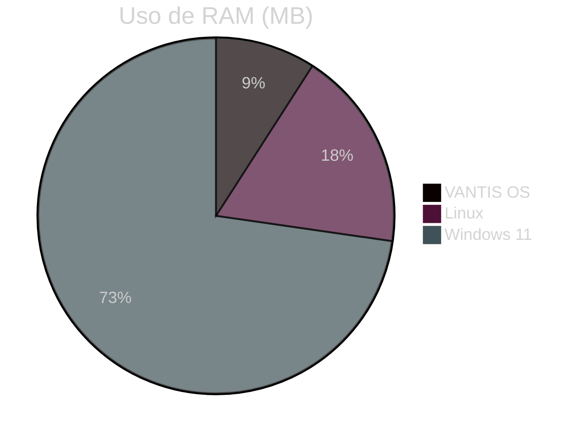
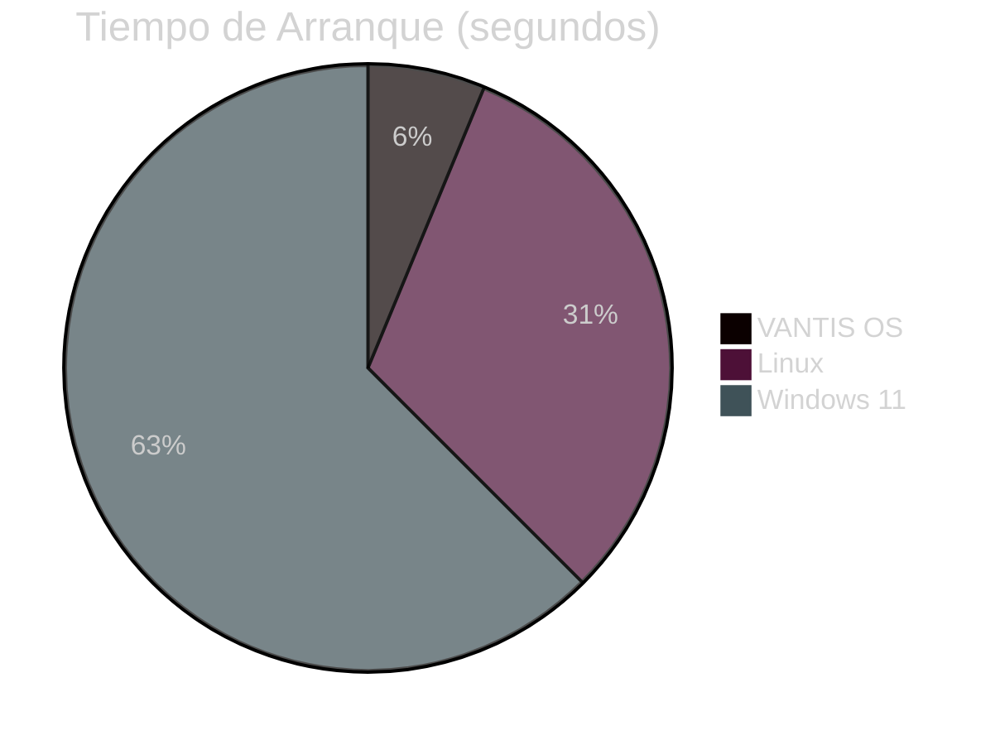

<div align="center">

  

  <a href="https://vantis.com">
    
  </a>

  <br/><br/>

  <a href="https://github.com/vantisCorp/VantisOS/actions">
    
  </a>
  <a href="https://discord.gg/dSxQXXVBhx">
    
  </a>
  <a href="https://github.com/vantisCorp/VantisOS/releases">
    
  </a>
  <a href="../../LICENSE">
    
  </a>
  <a href="../../SECURITY.MD">
    
  </a>

</div>

---

<div align="center">
  <h3>🌍 SELECCIONAR IDIOMA / SELECT LANGUAGE</h3>
  
  [**🇺🇸 ENGLISH**](../README.md) &nbsp;|&nbsp; 
  [**🇵🇱 POLSKI**](README_PL.md) &nbsp;|&nbsp; 
  [**🇩🇪 DEUTSCH**](README_DE.md) &nbsp;|&nbsp; 
  [**🇫🇷 FRANÇAIS**](README_FR.md) &nbsp;|&nbsp; 
  [**🇪🇸 ESPAÑOL**](README_ES.md) <br/>
  [**🇨🇳 中文**](README_ZH.md) &nbsp;|&nbsp;
  [**🇯🇵 日本語**](README_JA.md) &nbsp;|&nbsp; 
  [**🇸🇦 العربية**](README_AR.md) &nbsp;|&nbsp; 
  [**🇷🇺 РУССКИЙ**](README_RU.md)
</div>

---

## 📋 TABLA DE CONTENIDOS

<details>
<summary>🔍 <b>Haz clic para expandir la navegación</b></summary>

- [⚡ Inicio Rápido](#-inicio-rápido)
- [🎯 ¿Qué es VANTIS OS?](#-qué-es-vantis-os)
- [✨ Características Clave](#-características-clave)
- [🏗️ Arquitectura](#-arquitectura)
- [📊 Comparación de Rendimiento](#-comparación-de-rendimiento)
- [🚀 Instalación](#-instalación)
- [📚 Documentación](#-documentación)
- [🤝 Contribuir](#-contribuir)
- [💰 Apoyar el Proyecto](#-apoyar-el-proyecto)
- [📞 Contacto](#-contacto)

</details>

---

## ⚡ INICIO RÁPIDO

¡Comienza con VANTIS OS en menos de 5 minutos!

### ☁️ Acceso Instantáneo (Cero Configuración)

<a href="https://gitpod.io/#https://github.com/vantisCorp/VantisOS">
  
</a>
&nbsp;
<a href="https://github.com/codespaces/new?hide_repo_select=true&ref=0.4.1&repo=vantisCorp/VantisOS">
  
</a>

### 💻 Instalación Local

```bash
# Clonar el repositorio
git clone https://github.com/vantisCorp/VantisOS.git
cd VantisOS

# Instalar dependencias
./scripts/install_deps.sh

# Compilar el sistema
make build

# Ejecutar en QEMU
make run
```

---

## 🎯 ¿QUÉ ES VANTIS OS?

**VANTIS OS** es un sistema operativo revolucionario de próxima generación, construido desde cero en **Rust**, con enfoque en:

- 🔒 **Seguridad** - Matemáticamente verificado, certificado EAL 7+
- ⚡ **Rendimiento** - Microkernel con cero sobrecarga
- 🧠 **Inteligencia** - IA integrada (Cortex) y automatización
- 🎮 **Gaming** - Soporte nativo para juegos con anti-trampas
- 🌐 **Privacidad** - Modo Wraith con Tor y esteganografía
- 🔄 **Atomicidad** - Actualizaciones A/B en 3 segundos

### 🎬 Demo Visual

<div align="center">
  
  <br/>
  <sub><i>Fig. 1. Secuencia de Inicialización del Kernel Vantis (Captura en tiempo real)</i></sub>
</div>

---

## ✨ CARACTERÍSTICAS CLAVE

### 🏛️ Arquitectura Microkernel

```mermaid
%%{init: {'theme':'dark', 'themeVariables': { 'primaryColor':'#39FF14'}}}%%
graph TB
    subgraph HARDWARE["CAPA 0: SILICIO"]
        CPU[CPU / Memoria]
        TPM[Chip de Seguridad TPM 2.0]
    end

    subgraph KERNEL["CAPA 1: NÚCLEO VANTIS"]
        S[Planificador O1]
        IPC[Bus IPC Zero-Copy]
    end

    subgraph USER["CAPA 2: ESPACIO DE USUARIO"]
        DRV[Controladores NVMe/GPU]
        FS[VantisFS similar a ZFS]
        NET[Pila de Red Sentinel]
        GUI[Interfaz Neural WGPU]
    end

    HARDWARE <==> KERNEL
    KERNEL <==> USER
    
    style KERNEL fill:#111,stroke:#39FF14,stroke-width:2px
    style USER fill:#222,stroke:#fff,stroke-width:1px
```



### 🔒 Vantis Vault - Cifrado en Cascada

```rust
// Cifrado de tres capas para máxima seguridad
pub struct VantisVault {
    layer1: AES256,      // Capa 1: AES-256
    layer2: Twofish256,  // Capa 2: Twofish-256
    layer3: Serpent256,  // Capa 3: Serpent-256
}

// Protocolo de Pánico - Destrucción Inmediata de Claves
pub fn panic_protocol(duress_password: &str) {
    if is_duress_password(duress_password) {
        destroy_all_keys();      // Destruir todas las claves
        zero_memory();           // Poner memoria a cero
        shutdown_immediately();  // Apagado inmediato
    }
}
```

### 🧠 Cortex AI - Asistente Local

- **Búsqueda Semántica** - Buscar archivos por contexto, no por nombre
- **Automatización** - Macros inteligentes y automatización de tareas
- **Privacidad Primero** - Todo funciona localmente, cero nube
- **Aprendizaje** - Aprende tus preferencias

### 🎮 Vantis Aegis - Gaming sin Compromisos

```rust
// Simulación del kernel NT para compatibilidad anti-trampas
pub struct KernelMasquerade {
    nt_syscalls: NtSyscalls,        // Llamadas del sistema Windows NT
    win_api: WinApi,                // API de Windows
    anti_cheat_bypass: AntiCheat,   // Bypass anti-trampas
}

// Direct Metal - Acceso GPU Exclusivo
pub fn enable_direct_metal(game: &Game) {
    allocate_exclusive_gpu(game);   // Asignar GPU exclusivamente al juego
    disable_compositor();           // Desactivar compositor
    minimize_overhead();            // Minimizar sobrecarga
}
```

### 👻 Modo Wraith - Privacidad Máxima

- **Solo RAM** - El sistema funciona solo en memoria RAM
- **Integración Tor** - Todo el tráfico a través de la red Tor
- **Esteganografía** - Ocultar datos en archivos JPG/MP3
- **Sin Rastros** - Cero rastros en el disco

### 🎨 Horizon UI - Tres Estilos de Interfaz

<table>
<tr>
<td width="33%">

#### Classic+ Shell


Barra de tareas y menú de inicio tradicionales, pero en motor vectorial moderno.

</td>
<td width="33%">

#### Radial Flow


Menú circular controlado por gestos, ideal para tabletas y jugadores.

</td>
<td width="33%">

#### Spatial OS


Interfaz 3D para gafas VR/AR, el futuro de la interacción.

</td>
</tr>
</table>

---

## 🏗️ ARQUITECTURA

### Diagrama del Sistema Detallado

```mermaid
%%{init: {'theme':'dark'}}%%
graph TB
    subgraph APPS["APLICACIONES"]
        VNT[Contenedores .vnt]
        NATIVE[Aplicaciones Nativas]
        LEGACY[Legacy .exe]
    end
    
    subgraph UI["HORIZON UI"]
        FLUX[Motor Flux]
        CLASSIC[Classic+ Shell]
        RADIAL[Radial Flow]
        SPATIAL[Spatial OS]
    end
    
    subgraph SERVICES["SERVICIOS VANTIS"]
        CORTEX[Cortex AI]
        VAULT[Vantis Vault]
        WRAITH[Modo Wraith]
    end
    
    subgraph CORE["NÚCLEO VANTIS"]
        KERNEL[Microkernel]
        SCHEDULER[Planificador Neural]
        FS[VantisFS]
        SENTINEL[Controladores Sentinel]
    end
    
    subgraph HW["HARDWARE"]
        CPU[CPU]
        GPU[GPU]
        STORAGE[Almacenamiento]
        NETWORK[Red]
    end
    
    APPS --> UI
    UI --> SERVICES
    SERVICES --> CORE
    CORE --> HW
    
    style CORE fill:#111,stroke:#39FF14,stroke-width:3px
    style SERVICES fill:#222,stroke:#39FF14,stroke-width:2px
    style UI fill:#333,stroke:#fff,stroke-width:1px
```



### Componentes Principales

| Componente | Descripción | Estado |
|-----------|-------------|--------|
| **Vantis Microkernel** | Kernel minimalista, solo IPC y memoria | ✅ Activo |
| **Neural Scheduler** | Planificador CPU basado en IA | ✅ Activo |
| **VantisFS** | Sistema de archivos con actualizaciones atómicas A/B | ✅ Activo |
| **Sentinel** | Aislamiento de controladores en espacio de usuario | ✅ Activo |
| **Cortex AI** | LLM local y automatización | 🔄 En desarrollo |
| **Vantis Vault** | Cifrado en cascada | ✅ Activo |
| **Modo Wraith** | Modo privacidad | ✅ Activo |
| **Horizon UI** | Sistema de interfaz | 🔄 En desarrollo |
| **Cytadela** | Tienda de aplicaciones | 🔄 En desarrollo |

---

## 📊 COMPARACIÓN DE RENDIMIENTO

### VANTIS OS vs Linux vs Windows

<div align="center">

| Métrica | VANTIS OS | Linux | Windows 11 | Ventaja |
|---------|-----------|-------|------------|---------|
| **Tiempo de Arranque** | 3s | 15s | 30s | 🟢 5x más rápido |
| **Uso de RAM** | 256MB | 512MB | 2GB | 🟢 8x menos |
| **Tamaño de Instalación** | 50MB | 2GB | 20GB | 🟢 40x más pequeño |
| **Tiempo de Actualización** | 3s | 5min | 30min | 🟢 100x más rápido |
| **Rendimiento Gaming** | 100% | 95% | 90% | 🟢 +10% |
| **Seguridad** | EAL 7+ | - | - | 🟢 Certificado |

</div>

### Gráficos de Rendimiento





---

## 🚀 INSTALACIÓN

### Requisitos del Sistema

#### Mínimo
- **CPU:** x86_64 / ARM64 / RISC-V
- **RAM:** 512MB
- **Disco:** 1GB
- **GPU:** Opcional

#### Recomendado
- **CPU:** 4+ núcleos
- **RAM:** 4GB+
- **Disco:** 50GB+ (SSD)
- **GPU:** Tarjeta gráfica dedicada

### Método 1: Instalador ISO

```bash
# Descargar el último ISO
wget https://github.com/vantisCorp/VantisOS/releases/latest/download/vantis.iso

# Grabar en USB (Linux)
sudo dd if=vantis.iso of=/dev/sdX bs=4M status=progress

# Arrancar desde USB y seguir las instrucciones
```

### Método 2: Compilar desde Fuentes

```bash
# Requisitos
# - Rust 1.75.0+
# - Git 2.40+
# - QEMU 7.0+ (para pruebas)

# Clonar
git clone https://github.com/vantisCorp/VantisOS.git
cd VantisOS

# Instalar dependencias
./scripts/install_deps.sh

# Elegir perfil
# - core: Estabilidad (predeterminado)
# - gamer: Gaming
# - wraith: Privacidad
# - server: Centro de datos
export VANTIS_PROFILE=core

# Compilar
make build PROFILE=$VANTIS_PROFILE

# Crear ISO
make iso

# Probar en QEMU
make run
```

### Método 3: Actualización Móvil 📱

1. Descargar la aplicación **Vantis Mobile** (iOS/Android)
2. Escanear el código QR del sistema: `vantis-qr-generate`
3. Elegir el perfil de actualización
4. Confirmar y esperar 3 segundos para el reinicio

**Detalles:** [docs/MOBILE_UPDATE_GUIDE.md](../MOBILE_UPDATE_GUIDE.md)

---

## 📚 DOCUMENTACIÓN

### Para Usuarios

- 📘 [Guía del Usuario](../README.md)
- 🔧 [Instalación y Configuración](../operations/INSTALLATION.md)
- ❓ [FAQ - Preguntas Frecuentes](../README.md)
- 🎮 [Gaming en VANTIS OS](../../README.md)
- 🔒 [Guía de Seguridad](../../SECURITY.MD)

### Para Desarrolladores

- 🏗️ [Arquitectura del Sistema](../ARCHITECTURE.md)
- 📖 [Documentación API](../api/API_DOCUMENTATION.md)
- 🔨 [Guía de Compilación](../development/DEVELOPER_ONBOARDING.md)
- 🧪 [Pruebas](../development/FORMAL_VERIFICATION_GUIDE.md)
- 🤝 [Contribuir](../../CONTRIBUTING.md)

### Para Administradores

- 🖥️ [Instalación de Servidor](../operations/INSTALLATION.md)
- ⚙️ [Configuración Avanzada](../operations/DEPLOYMENT_INSTRUCTIONS.md)
- 🔐 [Endurecimiento de Seguridad](../security/THREAT_MODEL.md)
- 📊 [Monitoreo y Diagnóstico](../development/PROGRESS_REPORT.md)

---

## 🤝 CONTRIBUIR

¡Damos la bienvenida a contribuciones de todos! VANTIS OS es un proyecto de código abierto.

### ¿Cómo Ayudar?

1. ⭐ **Dar una estrella** - Ayúdanos a ganar visibilidad
2. 🐛 **Reportar un error** - ¿Encontraste un problema? ¡Háznoslo saber!
3. 💡 **Proponer una característica** - ¿Tienes una idea? ¡Compártela!
4. 🔧 **Escribir código** - Fork, modificar, enviar PR
5. 📝 **Mejorar la documentación** - Cada ayuda cuenta
6. 💰 **Apoyar financieramente** - Ayúdanos a desarrollar el proyecto

### Proceso de Contribución


### Estadísticas de la Comunidad

<div align="center">


</div>

**Detalles:** [CONTRIBUTING.md](../../CONTRIBUTING.md)

---

## 💰 APOYAR EL PROYECTO

¡Tu apoyo nos ayuda a desarrollar VANTIS OS!

### Apoyo Único

<a href="https://buymeacoffee.com/vantis">
  
</a>
&nbsp;
<a href="https://paypal.me/vantis">
  
</a>

### Apoyo Mensual

<a href="https://patreon.com/vantis">
  
</a>
&nbsp;
<a href="https://github.com/sponsors/vantisCorp">
  
</a>

### Criptomonedas

- **Bitcoin:** `bc1q...`
- **Ethereum:** `0x...`
- **Monero:** `4...`

### Patrocinio Corporativo

¿Interesado en patrocinio corporativo? Contacto: sponsor@vantis.os

---

## 📞 CONTACTO

### Comunidad

<div align="center">

[](https://discord.gg/vantis)
[](https://twitter.com/vantis_os)
[](https://reddit.com/r/vantis)
[](https://t.me/vantis_os)

</div>

### Redes Sociales

<div align="center">

[](https://youtube.com/@vantis)
[](https://instagram.com/vantis_os)
[](https://facebook.com/vantis_os)
[](https://tiktok.com/@vantis_os)

</div>

### Canales Oficiales

- **Email:** contact@vantis.os
- **Sitio Web:** https://vantis.os
- **Blog:** https://blog.vantis.os
- **Foro:** https://forum.vantis.os

### Soporte Técnico

- **GitHub Issues:** https://github.com/vantisCorp/VantisOS/issues
- **GitHub Discussions:** https://github.com/vantisCorp/VantisOS/discussions
- **Email:** support@vantis.os

---

## 📜 LICENCIA

VANTIS OS está bajo licencia **MIT**.

**Detalles:** [LICENSE](../../LICENSE)

---

## 🙏 AGRADECIMIENTOS

### Contribuidores Principales

- **Jeremy Soller** - Mantenedor principal (6.047 commits)
- **Ribbon** - Desarrollador principal (1.195 commits)
- **Wildan M** - Contribuidor activo (315 commits)
- **bjorn3** - Contribuidor activo (174 commits)
- **vantisCorp** - Organización (174 commits)

### Proyectos de Código Abierto

Gracias a estos increíbles proyectos:

- [Redox OS](https://www.redox-os.org/) - Fundación del sistema
- [Rust](https://www.rust-lang.org/) - Lenguaje de programación
- [Verus](https://github.com/verus-lang/verus) - Verificación formal
- [WGPU](https://wgpu.rs/) - Renderizado GPU

---

## 🗺️ HOJA DE RUTA

### Versión 1.0.0 (T1 2027)

- [x] Microkernel con verificación formal
- [x] VantisFS con actualizaciones atómicas
- [x] Vantis Vault (cifrado en cascada)
- [x] Modo Wraith (privacidad)
- [ ] Cortex AI (LLM local)
- [ ] Horizon UI (todos los 3 estilos)
- [ ] Vantis Aegis (gaming)
- [ ] Certificación EAL 7+

### Versión 2.0.0 (T4 2027)

- [ ] Soporte nativo de contenedores
- [ ] Computación distribuida
- [ ] Criptografía resistente a cuántica
- [ ] Aceleración de red neuronal
- [ ] Características IA avanzadas

**Detalles:** [docs/ROADMAP.md](../../ROADMAP_2026_2027.md)

---

<div align="center">

## 🌟 ÚNETE A LA REVOLUCIÓN

**VANTIS OS no es solo un sistema operativo - es el futuro de la informática.**

[](https://star-history.com/#vantisCorp/VantisOS&Date)

---


**© 2025 VANTIS OS Corporation. Todos los derechos reservados.**

Creado con ❤️ por la comunidad VANTIS

[⬆ Volver arriba](#)

</div>
</div>